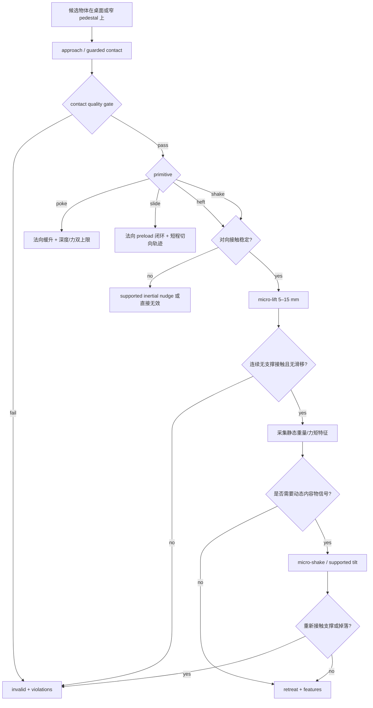

# 面向必须依靠触觉的 Probe 基准设计与实现建议

## 执行摘要

你现有的 `1stea`/AllegroProbe v1 已经做对了两件最关键的事：第一，把四个 primitive 明确绑定到四类“主要可信信号”——`poke` 对应刚度、`heft` 对应脱离支撑后的腕部力、`shake` 对应通过 heft gate 后的腕部力矩动态响应、`slide` 对应 preload 闭环下的切向/法向力比；第二，把 probe 结果拆成 `valid`、`violations`、`quality`、`features`，避免把控制失败伪装成“有意义的物理估计”。这对基准尤其重要，因为你最终要衡量的是“是否通过安全试探获得了可信物理证据”，而不是单纯把动作执行完。仓库 README 与 `docs/v1/main.md` 也已经把 phased control、pedestal 约束、tier 化评测、TSR/IE/PAU 等核心框架搭好了。citeturn3view0turn4view0turn27view1turn28view0turn28view1

真正卡住 v1 的，不是思路错误，而是 **heft/shake 在桌面场景里天然比 poke/slide 更难安全实现**。经典触觉心理学里，硬度最对应“pressure”，纹理最对应“lateral motion”，重量最对应“unsupported holding”；也就是说，`poke` 和 `slide` 本来就适合“物体仍被桌面支撑”的安全试探，而 `heft` 要想得到直接重量信号，先天更依赖“脱离支撑”。这解释了为什么你现在觉得 `slide/poke` 顺手、`heft/shake` 别扭——这不是工程偶然，而是动作—信号耦合的结构性差异。citeturn14view0

因此，我的核心建议是：**保留四个 probe 名字，但重写它们的“基准语义”与“安全包络”**。具体说，`poke` 和 `slide` 继续作为 v1 主力；`heft` 改为“**微抬离支撑的 micro-lift**”，而不是追求掌心托举；`shake` 改为“**通过 heft gate 的 micro-shake / supported tilt**”，只服务于惯性与内容物移动性，而不再追求大幅晃动。若稳定离支撑抓取做不到，就让 `heft` 退化为“**supported inertial nudge**”赛道，把它明确定义为“惯性 proxy”而不是“纯重量 EP”。这和交互感知、机器人推动估计惯性参数、以及仅靠机器人本体感知识别质量/柔软度的文献方向是一致的。citeturn30search0turn19search11turn19search2turn32view2

液体部分不值得在 v1 上重投入完整流体仿真。更务实的路线是：真机用 **封闭不透明容器 + 微倾/微摇**，直接以腕部 wrench、关节电流或 IMU/音频做判别；仿真用 **内部移动质量块** 或 **质量-弹簧-阻尼 slosh proxy**，而不是 CFD。Berkeley 的工作已经证明，机器人通过一系列 tilting motion 观察腕部 wrench，可以估计封闭容器中液体的质量、体积甚至黏度；而液体建模文献长期大量使用 multi-mass–spring 近似来刻画主 slosh mode，这足够支撑基准层面的“内容物移动性”表征。citeturn32view3turn33view1

从 benchmark 角度，我建议你把“必须依靠触觉”定义为：**在标准视觉设定下，关键物理属性不可见；只有主动接触产生的信息才能把策略从不确定推向可执行**。这与 `ProbeBench` 文档里对 `Gap_task`、TSR、SR、IE、PAU、tier 化对比、以及纯视觉 / 被动触觉 / reactive / heuristic active / exhaustive / oracle / human 遥操基线的设计完全一致。你现有文档已经足够支撑一版严谨的 benchmark 论文叙事，下一步需要的不是再发散 primitive 数量，而是 **把四个 primitive 的安全动作原型、标签、gating 和最小可复现实验冻结下来**。citeturn1view0turn27view1turn28view0turn28view1

## 现状诊断与总设计原则

你当前仓库把 probe 执行层定义得相当清楚：两套 backend 共享同一命令、状态机、传感语义和结果结构；`poke/slide` 主要走中央仪器化探针；`heft/shake` 在 reference backend 上用“带底缘承托钩的双指参考夹爪”，在 Allegro backend 上用真实 Allegro 关节与碰撞体；所有 primitive 都遵循 `approach → guarded contact/descent → contact establishment → contact quality gate → primitive execution → post-check → retreat` 的显式分阶段控制。尤其值得保留的是，`heft` 和 `shake` 均要求形成对向接触、脱离 pedestal/table、相对腕部稳定且穿透受限；`shake` 还要求一旦重新接触支撑、持续丢失对向接触或掉落，就判为无效。这个定义已经天然指向“安全性是 first-class signal”的 benchmark 口径。citeturn3view0turn4view0

从动作—信号匹配角度看，`poke`/`slide` 与人类触觉探索程序是高度一致的：`pressure` 对应硬度/刚度，`lateral motion` 对应纹理/摩擦；而 `unsupported holding` 才是经典重量感知动作。也就是说，**`heft` 难，不是因为你现在实现得不够像人，而是因为它本来就要求把物体从环境支撑里“抽离出来”**。因此，工程上最合理的做法不是勉强让 Allegro 掌心去做全托举，而是把“称量动作”重定义成一个安全、短程、可门控的 **micro-lift**。这比继续追求裸掌托举更符合 benchmark 的可复现性。citeturn14view0

另一个重要原则是：**把“probe 的目标信号”与“具体手型姿态”解耦**。交互感知的核心不是动作长得像人，而是机器人用可控动作制造原本不存在的信息。只要动作稳定地产生对任务有判别力的物理信号，它就可以成为 benchmark 的标准 probe。你的 reference backend 已经用“底缘承托钩 + 双指”证明了这一点；这其实不是临时 hack，而应上升为 v1 的“规范动作原型”。citeturn30search0turn3view0

最后，关于你提到的“连通性”：如果你说的是“有没有活动件、是否密封、有没有内部松动件、局部是否与整体连成一体”，那它在经典触觉文献里更接近 **part motion test / function test**，而不是简单归入 `poke` 或 `slide`。我的建议是，v1 里可以让 `poke` 的“多点局部顺应性图”和 `slide` 的“跨缝/跨边滑动不连续性”提供弱连通信号；但若未来你想把“连通性/可动部件”做成 benchmark 主属性，最好在 v1.5 单独加一个 `twist` 或 `part-motion` primitive，而不要把它硬塞进 `heft/shake/slide/poke` 四个桶里。citeturn14view0

## 四类 probe 的目标信号与安全动作原型

下面这张表给出我建议冻结到 benchmark protocol 里的四个 probe 语义。表里的“动作原型”是为了让同一 probe 在参考夹爪、Allegro、以及未来别的手上都有统一可复现的安全边界，而不是为了限制研究者必须采用唯一轨迹。你现有仓库中的 state machine 与 validity gate 可以直接承接这套定义。citeturn4view0turn27view1



| Probe | 建议主目标信号 | 建议次目标信号 | 安全动作原型 | 是否需托举 | 建议起始接触与阈值 | 主要风险 | 缓解策略 |
|---|---|---|---|---|---|---|---|
| `poke` | 法向力—位移曲线 `F_n(d)`、等效刚度 `k_eff=ΔF/Δd`、迟滞面积、松弛比率；若做多点 poke，可形成局部顺应性图。`poke` 在你仓库里本来就以 `probe_force` 法向分量闭环，并以最大安全压入量做有效性边界。citeturn4view0turn14view0 | 局部中空/空洞感、缝边不连续、弱连通信号。若未来专门做连通性，建议独立出 `part-motion/twist` primitive。citeturn14view0 | 单个钝头探针或软指腹，在背后有桌面/治具支撑的前提下，做法向缓升；达到目标力或目标压入深度即停止，并可加 100–300 ms 保持段观察松弛。 | 否 | 探头等效接触直径建议 4–8 mm；法向力起始值 0.3–0.5 N，常见小物体上限 1–2 N；压入深度建议对象局部尺寸的 3–8% 先试。 | 捅翻、压坏、刺穿软物体 | 力和深度双上限；在物体背后放被动支撑；尖头禁用，统一钝头几何；一旦接触法向快速飙升或对象位姿突变立即 abort。 |
| `slide` | 有效摩擦比 `μ_eff≈|F_t|/F_n`、stick-slip 事件数、切向振动频谱、有效接触占比。你的仓库已经把 `slide` 定义为 preload 闭环下的切向/法向力比，这个定义应直接保留。citeturn4view0 | 纹理、表面材料类别、跨缝/跨边界的不连续性，适合做“材质”和弱“连通性”判别。经典 EP 将 lateral motion 与 texture 强绑定。citeturn14view0 | 单指腹或中央 probe 在物体表面以恒法向 preload 接触，沿 10–30 mm 短程路径往返滑动。对表面跟踪问题，可借鉴 tactile servoing 的 controlled soft touch。citeturn18search1turn22view3 | 否 | 软垫接触宽度建议 6–10 mm；法向 preload 起始值 0.3–1.0 N；切向速度建议 5–20 mm/s；路径最好短、双向、可回零。 | 推走物体、顶翻高瘦物、因局部静摩擦突变导致失联 | 桌面加低矮背挡或窄 pedestal；PI 保持法向 preload；路径做短行程往返而非单向长推；把对象平移超过阈值记为 violation。 |
| `heft` | **真重量信号**：脱离支撑后的 baseline-corrected 腕部力；**姿态/CoM proxy**：腕部力矩和 hold-phase 漂移。你仓库当前就是这样定义 mass 信号，并要求支撑接触连续消失。citeturn4view0turn27view1 | 抓取稳定性、质心偏置、微滑移趋势。若完全无法离支撑，可退化为“supported inertial nudge”，那时它测的是惯性 proxy，不应再标作纯重量 EP。推动/交互感知文献支持通过单次推/微扰估计质量与摩擦。citeturn14view0turn19search2turn19search11 | **标准动作改成 micro-lift**：两指对向接触，必要时允许底缘小钩/小搁台辅助；从支撑面抬离 5–15 mm，保持 150–300 ms，采样后立即回放。若 grasp gate 未通过，则执行 supported inertial nudge，作为单独赛道。 | 是，但只做微抬离，不做掌心长时间托举 | 建议至少有两组对向接触；对光滑圆柱，优先抓腰部或底缘外圈；竖直 lift 速度建议 ≤20 mm/s；lift 高度不超过 15 mm。 | 滑落、二次碰桌、手指夹坏、手—桌碰撞 | 采用窄 pedestal 与下方 catch zone；低 lift、短保持；以支撑接触消失 + 对向接触持续 + 相对腕部稳定三者共同定义 valid；推荐把 reference backend 的“底缘承托钩”升格为官方原型。citeturn3view0turn4view0 |
| `shake` | 动态腕部力矩/加速度响应、峰频率、阻尼衰减、相位滞后；其本质不是“摇得猛”，而是“让内容物或惯性分布产生可辨动态响应”。仓库里 `shake` 已明确依赖和 `heft` 相同的抓取与离支撑 gate。citeturn4view0 | 内容物是否可移动、填充程度、液体/颗粒/凝胶的动态类别；封闭容器的微倾/微晃已被用于仅凭 wrist wrench 估计液体质量、体积和黏度。citeturn32view3 | **标准动作改成 micro-shake / supported tilt**：对通过 heft gate 的物体，做 ±2–5° 的 wrist roll/pitch 或 ±2–4 mm 的短程正弦位移，频率 2–4 Hz，持续 0.3–0.8 s。若你不想承担自由空间风险，则改为“离支撑 0–3 mm 的 quasi-lift + 微倾”。 | 原则上是；若改 supported tilt，可不完全离支撑 | 只允许封闭容器；先采一小段静止基线，再采动态段；动态段结束后必须回零并复核对向接触。 | 掉落、重新碰桌、内容物溢出、振动太小无信号 | 仅在 sealed container track 启用；大幅摆动禁用；一旦 support re-contact、contact loss 或 object pose 飘移超阈值立刻无效；开放液体不进 v1 主赛道。 |

更具体地说，我建议把四个 probe 的 **标准 feature schema** 固定下来，而不是把“模型自己学什么”留给后处理。对 `poke`，至少输出 `k_eff`、迟滞面积、松弛比；对 `slide`，至少输出 `μ_eff`、接触有效占比、振动 PSD 或 stick-slip 计数；对 `heft`，至少输出静态 `ΔF_z`、`‖τ_wrist‖`、hold-phase 方差；对 `shake`，至少输出频谱主峰、阻尼、相位滞后、动态幅值比。这样做有两个好处：一是能和你当前 `ProbeResult.features` 设计对齐，二是便于后续做“属性估计精度”与“信息效率”的分解诊断。citeturn3view0turn4view0turn28view1

这里最值得强调的一点是：**`heft` 可以保留，但必须从“托在掌心掂”改成“安全微抬离支撑称重”**。人类 EP 里“unsupported holding”是重量的直接动作；但 benchmark 不需要复刻“整只手托举”的外形，只需要保留“支撑消失后，系统通过自身受力辨别质量”的信息条件。只要 pedestal/contact gate 明确，micro-lift 就足以满足这一点。你仓库现在正好已经具备这样的 gating 逻辑。citeturn14view0turn4view0

## 液体与内容物的简化替代方案

你已经敏锐地意识到：**液体仿真复杂且性价比低**。这一判断有坚实的文献支撑。Berkeley 的封闭容器液体感知工作明确指出，液体行为的复杂流体力学很难精确建模，但通过一系列倾斜动作观测腕部 wrench，仍然可以估计质量、体积与黏度；而更传统的液体运动学/控制文献也常用 multi-mass–spring 近似来抓住主要 slosh mode，而不是直接做高保真流体仿真。对 benchmark 来说，这意味着你完全可以 **把“液体存在/装满/内容物可移动性”作为动态物理属性来测，而不是把 CFD 当成核心贡献**。citeturn32view3turn33view1

| 方案 | 真实世界可行性 | 仿真实现成本 | 安全性 | 我建议的用途 |
|---|---|---:|---:|---|
| 开放液体 + 自由空间晃动 | 中等 | 很高 | 低 | 不建议进 v1 主赛道。它更像“机器人液体操作”课题，而不是“必须依靠触觉的安全 probe”课题。开放液体会把掉落、洒出、容器刚度和环境清理耦合到一起。citeturn32view3turn12search5 |
| **封闭不透明容器 + micro-shake / tilt** | 高 | 中等 | 高 | **推荐作为真实 benchmark 的 fill/content 轨**。判别对象可设为空、半满、满，或“水/油/凝胶/颗粒”动态类别；读数只需要 wrist wrench、关节电流、IMU 或音频。Berkeley 工作就是这一类范式。citeturn32view3turn29search1 |
| **内部移动质量块 / 质量-弹簧-阻尼 proxy** | 高 | 低 | 高 | **推荐作为仿真 fill 轨**。外壳保持一致，内部用一个或两个隐含 DOF 质量块再加阻尼/弹簧，去模拟“内容物会不会跟手、会不会滞后、会不会有低频晃动”。这与 slosh literature 的低阶近似一致。citeturn33view1 |
| 颗粒、钢珠、凝胶袋、可压缩泡棉填充 | 高 | 低 | 高 | 适合早期 ablation：它们不是真流体，但能稳定地产生“移动内容物”“松散内容物”“黏滞内容物”“可压缩内容物”等不同动态签名，用于验证 probe 是否真的依赖触觉。citeturn32view3turn13search1 |
| 仅用传感器代理量，不建流体 | 很高 | 很低 | 很高 | 若你的目标只是 benchmark，而不是还原流体动力学，这条路最划算：直接把任务标签定义为“基于 wrist torque/joint current/IMU/audio 可分的 dynamic-content class”。这与你文档中的 T-Force / T-Acoustic tier 完全一致。citeturn27view1 |

如果你追求的是“必须依靠触觉”，我建议把“液体存在”进一步改写成更清楚的 benchmark 定义：**不是识别‘它是不是水’；而是识别‘它内部是否存在会在微扰下发生质心移动的内容物，以及这种移动性会不会改变后续安全操作策略’**。这样定义以后，封闭液体、颗粒、凝胶袋、自由移动砝码，甚至高阻尼内置块，都可以成为同一属性家族下的不同实例。标签也不必执着于“液体”二值，而可以更普适地标成 `mobility class / fill ratio / damping class`。这会让你的 benchmark 从“流体专用小众任务”变成“动态内容物感知”的通用触觉任务。这个改写与交互感知文献强调“通过动作制造信息”是一致的，也与 Berkeley 工作对 wrist wrench 动态信息的使用方式一致。citeturn30search0turn32view3

一个很实际的做法是分两层赛道。**Real track** 用同外壳的封闭容器：空杯、半满水、满水、半满稠液、半满颗粒。**Sim track** 则只提供统一几何外壳，内部隐藏一个单摆或一维滑块质量块，参数为质量比例、阻尼和行程限制。这样你就把“主 benchmark 的问题”压缩到一个稳定、易复现、能与真实动态趋势对齐的层面，而不用把开发时间烧在液面网格和流固耦合上。citeturn32view3turn33view1

## 仿真到真机的实现建议

首先，**把 reference backend 从“辅助后端”提升为 mass/fill 的规范后端**。你的 README 已写明：对 `heft/shake`，reference backend 使用“带底缘承托钩的双指参考夹爪”；这恰好解决了你最担心的“桌面上难以安全托举”问题。我的建议是，v1 benchmark 直接承认：对于 `mass/fill`，**规范动作原型就是双指对向接触 + 底缘辅助承托 + micro-lift/micro-shake**；Allegro 纯裸手实现则作为可选 embodiments，而不是主协议前提。否则，你会把 benchmark 的可复现性绑死在某一类掌心抓握能力上。citeturn3view0turn4view0

其次，仿真里要认真处理 **摩擦与接触维度**。MuJoCo 文档明确说明，`condim=3` 只建模法向 + 切向摩擦；`condim=4` 额外加入绕法向的 torsional friction，对软指 grasp 稳定性很有帮助；`condim=6` 再加入 rolling friction，可用于提升接触稳定性。对 `slide`，`condim=3` 通常足够；对 `heft/shake` 的抓持接触，建议至少上 `condim=4`，必要时做 `condim=6` 对照，以避免“仿真里总是神秘掉落”或者“只靠不现实的高 μ 才能抓住”的问题。citeturn20view0

第三，**支撑策略要显式建模，而不是靠碰撞作弊**。你当前仓库已经明确写了：`mass/fill` 场景对象初始放在窄 pedestal 上，进入 `heft/shake` 测量前必须连续确认 pedestal/table 接触消失；primitive 执行期间不通过切换 `contype/conaffinity` 制造穿模捷径。这一点必须保留，因为它直接决定“heft 到底测到的是桌面反力，还是物体真实重力”。同时，MuJoCo 允许用 `margin + gap` 产生“检测到接触但暂不施力”的 inactive contact，这很适合实现 early-warning 接近 guard，而不污染真正的力学读数。citeturn4view0turn20view0

第四，若你未来要引入视觉型触觉传感器，**不要把 TACTO 当作接触动力学权威**。官方 README 与 Meta 论文都说得很明白：TACTO 擅长高分辨率触觉图像渲染，但它不打算提供物理上精确的变形、摩擦和接触动力学，而是依赖底层物理引擎。换句话说，TACTO 适合渲染 `slide/poke` 的 tactile image；但 `heft/shake` 的真实性仍应由 MuJoCo 接触、惯性和支撑逻辑主导。citeturn22view0turn22view1

第五，**raw tactile image 不宜作为 v1 强制输入**。近两年的跨传感器 benchmark 已经明确暴露出明显 sensor shift：同样是 vision-based tactile sensor，不同设计之间做 zero-shot transfer 会明显掉性能，few-shot 适配也不能完全消除差距。因此，v1 最好把主评测接口定在 **物理层低维特征**——比如腕部 wrench、关节电流/位置、接触二值、切/法向力、contact ratio、有效面积——把 raw tactile image 设为“额外模态赛道”。这样你不会让 benchmark 一开始就被 DIGIT/GelSight/TacTip/自研皮肤的风格差异绑架。citeturn34search0turn31search1

第六，从真实机器人角度看，**是否需要专门的掌心动作** 取决于你要测的物理量。若目标是 `poke/slide`，指尖或中央 probe 就足够；若目标是 `heft/shake`，掌心并非必要，底缘支撑 + 对向夹持已经可以完成 micro-lift。只有当你后续要做“带支撑面的 in-hand regrasp”“手掌承托+手指探测”的更高复杂度设定时，掌心大面积皮肤才会成为高收益传感面。近年的触觉手论文也在强调 palm-finger coordination 的价值，但那更像 v2/v3 的增量，而不是 v1 能否成立的前提。citeturn26search0turn17search1turn16search4

## 实验设计与评估指标

你的 `ProbeBench` 文档已经给出了非常好的 benchmark 评价骨架：主指标用 TSR/IE/PAU，安全性单列 SR，另外再做属性估计精度、视觉信息缺口、校准和泛化差诊断。我建议沿用这套思想，但在 v1 先把“probe 自身质量”与“下游任务收益”同时报告，避免一开始就把压力全压在闭环 manipulation 上。citeturn28view0turn28view1

可以把实验分成两层。**层一是 probe-only**：给定同外观、不同物理属性的候选物，要求算法通过若干次主动 probe 后输出属性判断或排序。这里报告 `valid rate`、属性分类 AUROC/accuracy、连续属性 RMSE、排序 Spearman 相关、平均 probe 次数、每类 violation 频率。**层二是 probe-to-act**：把属性判断输送给一个固定下游策略，例如“挑最软/最重/最不满/最高摩擦对象再进行 pick-place”。这里报告 TSR、SR、IE、PAU，并额外保留“仅 probe 成功但后续 manipulation 失败”的拆分统计。这样你既能体现“必须依靠触觉”，也不会因为 manipulation 模块还不成熟而把 probe 设计淹没。这个分层也与 Tactile MNIST/APPLE 偏向主动感知、而你的文档强调“主动触诊闭环到下游操作”的定位差异相吻合。citeturn7search0turn8search1turn1view0

我建议冻结如下数据记录口径。每个 episode 至少保存：原始 trace、最终 `ProbeResult`、对象真值标签、对象外观实例 ID、候选组 ID、随机种子、物体初始位姿、所用 backend、传感 tier。你的执行层已经暴露了 `probe_touch`、`probe_force`、`probe_framepos`、`wrist_force`、`wrist_torque`、wrist pose、物体 pose、Allegro 指尖 touch/position、actuator force、以及从 MuJoCo contact buffer 直接得到的手指分组、支撑接触、法向力和 penetration；这已经足够支撑绝大多数诊断指标。citeturn3view0turn4view0

下面这张表是我建议在 v1 就冻结下来的核心指标。

| 指标 | 建议定义 | 回答的问题 |
|---|---|---|
| `TSR` | 沿用文档：**判别正确 ∧ 下游操作成功 ∧ 无安全违例** 的联合成功率。citeturn28view0 | 这套系统究竟有没有把“问明白”转化成“做成功”。 |
| `SR` | 沿用文档：`1 - violation rate`，单独报告超力、掉落、支撑重接触、对象平移过大、溢出等细分。citeturn28view1 | 你的 probe 是否真的“安全试探”。 |
| `VR` | `valid rate`：`ProbeResult.valid=True` 的比例。citeturn3view0turn4view0 | 控制完成和产生可信信号是不是两回事。 |
| 属性精度 | 分类用 accuracy/AUROC/F1；连续量用 RMSE/MAE；排序任务用 Spearman。 | 触觉信号本身有多可分。 |
| `P̄` / `IE` | 沿用文档：平均 probe 次数与 `IE = TSR / (1 + P̄)`。citeturn28view0 | 是不是“少问对答”，而不是穷举触诊。 |
| `PAU` | 继续作为主榜单综合指标，但 v1 可以先把离散 primitive 的次数作为代价代理。citeturn27view0turn28view0 | 成功和信息成本一起看时，谁真的更好。 |
| `ECE` / 熵下降 | 预测置信度校准、probe 次数随后的后验熵下降。文档已经把它列成诊断项。citeturn28view1 | 算法有没有“知道自己不知道”。 |
| `Gap_task` | 沿用文档：`TSR_oracle - TSR_vis`。citeturn1view0turn28view1 | 这个任务到底是不是“非触不可”。 |

基线动作集方面，我建议你直接照着文档的基线哲学去落地，而不是再自创一套命名。至少要有：纯视觉、被动触觉融合、reactive/compliant、启发式主动、穷举触诊、oracle、human 遥操。这样一来，你不仅能证明“触觉有用”，还能证明“主动触诊比边做边感更必要”以及“穷举触诊虽然可能成功但效率差”。这正是 PAU/IE 存在的价值。citeturn28view0

统计上，建议与文档一致：固定种子、分族报告、给出均值与 95% bootstrap CI，同种子做 paired comparison，多重比较校正用 Holm 或 Benjamini–Hochberg。只要样本数还不够，你就先把 v1 报成“pilot benchmark”，不要急着在首版就做很强的统计显著性结论。citeturn28view0

## 文献、开源实现、仿真工具与传感器优先级

### 核心文献与基准脉络

| 类别 | 优先读物 | 价值 |
|---|---|---|
| 触觉探索基础 | Lederman & Klatzky 1987《Hand Movements: A Window into Haptic Object Recognition》；Lederman & Klatzky 1993《Extracting object properties through haptic exploration》。citeturn14view0turn14view2 | 直接给出 hardness↔pressure、texture↔lateral motion、weight↔unsupported holding、part motion↔part-motion test 的动作—属性映射，是你为四个 probe 建立“为什么是这个动作”的最强原始依据。 |
| 交互感知综述 | Bohg 等《Interactive Perception》综述。citeturn30search0turn30search2 | 给出“通过动作制造信息”的总框架，正好为“必须依靠触觉”的 benchmark 提供理论母体。 |
| 主动触觉 benchmark | Tactile MNIST benchmark；APPLE。citeturn7search0turn8search1 | 帮你对齐“纯感知主动触觉 benchmark 长什么样”，并说明你为何还要闭环到 manipulation。 |
| 视觉-触觉 dex benchmark | VTDexManip。citeturn7search6turn7search12 | 说明“触觉加入 dex manipulation benchmark”已有基础，但主动 probe 决策仍是缺口。 |
| 通用 manipulation benchmark | LIBERO、CALVIN、VLABench。citeturn9search3turn9search1turn9search14 | 用来衬托你的 benchmark 与现有视觉/VLA benchmark 的差别：后者不是为“非触不可”设计的。 |
| 软接触/触觉伺服 | Pose-Based Tactile Servoing；pose-and-shear tactile servoing；Tactile Gym servo control。citeturn18search1turn18search7turn22view3 | 直接服务 `poke/slide` 的安全闭环与 controlled soft touch。 |
| 重量/惯性估计 | In-Hand Object-Dynamics Inference using Tactile Fingertips；Learning Object Properties Using Robot Proprioception via Differentiable Robot-Object Interaction；机器人推动/交互惯性估计综述与 PhyPush。citeturn24search0turn32view2turn19search11turn19search2 | 为 `heft` 的重量/惯性、`slide` 的 friction、以及“supported inertial nudge 是否有学术根据”提供直接支撑。 |
| 封闭容器内容物 | Haptic Perception of Liquids Enclosed in Containers。citeturn32view3 | 是你处理 `shake/fill` 的最强原始参考。 |

### 仿真工具与实现栈

| 工具 | 建议优先级 | 原因 |
|---|---|---|
| **MuJoCo + Menagerie** | 最高 | 你仓库已经基于 MuJoCo，Menagerie 还提供官方整理的 Wonik Allegro 模型；MuJoCo 文档对摩擦锥、`condim`、contact margin/gap 的解释也足够详细，适合把接触协议写死。citeturn11search3turn21view0turn21view1turn20view0 |
| **TACTO** | 中高 | 如果你要引入 DIGIT / OmniTact / GelSight 类视觉型触觉读数，TACTO 是现成选项；但请把它定位为 tactile rendering，不要让它主导物理正确性。citeturn22view0turn22view1 |
| **Tactile Gym / PBTS 实现** | 中高 | 更适合 `slide/poke` 的伺服和 sim-to-real 感知控制验证，而不是大幅度引入 dex grasp dynamics。citeturn11search1turn22view3turn31academia25 |
| **Sparsh / TacBench / TacVerse** | 中 | 如果将来做 raw tactile image 统一 benchmark，这些新 benchmark/representation 对跨传感器问题有价值；但我不建议它们成为你 v1 的前置依赖。citeturn34search19turn34search0 |

### 传感器优先级

我更建议按“**对 benchmark 有多必要**”排序，而不是按“学术上多酷”排序。

| 优先级 | 传感器/读数 | 适用 probe | 建议 |
|---|---|---|---|
| **P0** | 关节电流/力矩、腕部 F/T、接触二值 | `heft` `shake` `poke` `slide` | 如果你已经能稳定读到这些，v1 可以先不用额外硬件。你文档里的 T-Force tier 正是为此准备的。citeturn27view1 |
| **P1** | 单点或双点高分辨率指尖触觉（DIGIT / GelSight Mini / TacTip 一类） | `poke` `slide` | 优先提升法向曲线、切向摩擦和局部纹理读数质量。DIGIT 强调小型、低成本、高分辨率；GelSight 强于形状/剪切；TacTip 成本低、伺服闭环经验成熟。citeturn15search0turn15search1turn15search22turn15search8turn10search19turn10search20turn10search3turn10search7 |
| **P2** | 大面积皮肤/掌心皮肤（ReSkin / AnySkin） | `heft` `shake`，以及未来 palm-assisted 任务 | 如果你后续想做掌心承托、侧掌触碰、手面防撞，才值得上。AnySkin/ReSkin 的优势是可替换与多形态覆盖。citeturn16search1turn16search4turn17search0turn17search1 |
| **P3** | 接触麦克风 / IMU / 音频通道 | `slide` `tap` `shake` | 文档里的 T-Acoustic tier 非常值得保留。尤其对封闭内容物、材质和空心/密封类判别，音频/振动是很高性价比的补充。Sparsh-X 也显示音频、motion、pressure 的多模态融合值得重视。citeturn27view1turn34search18 |

综合起来，我会给出非常明确的工程排序：**先把 P0 读数与安全 gate 做扎实，再考虑 P1；P2 只在你明确要做 palm-assisted benchmark 时再上；P3 作为低成本扩展赛道长期保留**。这会让 benchmark 从第一天就具备跨硬件公平性。citeturn27view1

## 可复现的最小实现路径

如果目标是“尽快产出一版能跑、能比、能解释的 benchmark 原型”，我建议按下面这条最小路径推进。它尽量复用你仓库里已经存在的 API、scene、backend 和结果结构。README 已经给出 `ProbeCommand`、`ProbeHarness`、`ReferenceProbeBackend`、`AllegroHandBackend`、`make_demo_scene` 以及 `examples.run_probe_demo` 的基本调用方式和 CLI 入口。citeturn4view0turn25view0

| 阶段 | 你要冻结的东西 | 具体做法 | 预期产物 |
|---|---|---|---|
| 语义冻结 | 四个 probe 的官方定义 | `poke=刚度/局部顺应性`，`slide=摩擦/纹理`，`heft=micro-lift 重量`，`shake=micro-shake 或 supported tilt 的动态内容物`；把“连通性”列为 `poke/slide` 的弱标签，或推迟到 `twist`。 | 一页 protocol 文档 |
| 动作冻结 | 每个 primitive 的起始参数范围与 invalid 条件 | 把表中的力/位移/频率范围写进 YAML 或 dataclass；`heft/shake` 必须保留对向接触、支撑消失、重接触/掉落即 invalid 的 gate。 | `probe_defaults.yaml` |
| 对象冻结 | 先做小规模 minimal-pair | 每族先做 3 组、每组 3 个对象，合计 36 个实例以内；`mass` 和 `fill` 均用相同外壳。 | `ProbeBench-Objects-mini` |
| 标签冻结 | 真值与安全标签 | `mass`: 质量/CoM；`fill`: fill ratio/mobility class；`material`: `μ` 与材质类；`stiffness`: `k_eff` 参考值；安全标签统一记录 drop、spill、overforce、recontact、excess translation。 | CSV/JSON 标签文件 |
| 指标冻结 | v1 先报哪几项 | `VR + 属性精度 + TSR + SR + P̄ + IE` 必报；`PAU` 可先把离散 probe 次数作代价代理；等赛道稳定后再完善物理代价轴。 | 评测脚本 |
| 基线冻结 | 第一版必须出现的对照 | 纯视觉、reactive、heuristic active、exhaustive、oracle；若条件允许再加 human。 | 第一版 leaderboard |

下面这组参数表可直接作为 v1 的 **建议起始值**。它们不是“唯一正确值”，而是为了让你先把安全 envelope 标准化，方便调参和对比。

| Probe | 接触几何 | 力/位移建议起始值 | 时间/频率建议起始值 | 有效条件 | 立即失败条件 |
|---|---|---|---|---|---|
| `poke` | 钝头探针或单指腹 | `F_max=1.0 N`；`d_max=对象局部厚度的 5%` | ramp 0.5–1.0 s；hold 0.2 s | 达到目标力或目标深度、对象平移小 | 过力、对象翻倒、穿透异常 |
| `slide` | 软垫指腹 6–10 mm | preload `0.5 N` | 路径 20 mm；速度 10 mm/s；往返一次 | 接触有效占比高、路径完成 | preload 丢失严重、对象位移过大、顶翻 |
| `heft` | 两指对向 + 可选底缘小钩 | squeeze 只到建立稳定接触；lift 8 mm | hold 0.2 s；竖直速度 15–20 mm/s | 对向接触持续、支撑接触连续消失、漂移小 | drop、recontact、明显滑移、手撞桌 |
| `shake` | 沿用 `heft` 抓持 | 不再单独加大抓力 | ±3° 或 ±3 mm；`3 Hz`；持续 `0.5 s` | 全程抓持稳定且动态信号可测 | recontact、掉落、超幅振动 |

若你想在当前仓库 API 上做最小修改，我建议增加一个“**动作模式**”字段，而不是新开很多 primitive 名字。示意接口可以长这样：

```python
# 这是建议接口，不是你仓库当前的现成 API
cmd = ProbeCommand(
    primitive="heft",
    target=obj_id,
    params={
        "mode": "micro_lift",      # micro_lift / supported_nudge
        "lift_mm": 8,
        "hold_ms": 200,
        "max_z_speed_mm_s": 20,
        "require_support_loss_ms": 120,
    },
)

res = harness.execute(cmd)
```

这样做的好处是：评分脚本仍把它算作 `heft`，但 trace 和 metadata 里能分清它到底是“真重量 micro-lift”还是“惯性 proxy 的 supported nudge”。同理，`shake` 也可以用 `mode="micro_shake"` 与 `mode="supported_tilt"` 区分。你仓库现有的 `ProbeResult.valid`、`violations`、`quality`、`features` 完全适合承载这类模式化扩展。citeturn4view0turn3view0

最后，如果你只想 **最快做出一版有说服力的论文 demo**，我的建议是把首发范围主动收窄为下面这个组合：

1. `poke`：同外观软硬块，任务是“挑最软”。  
2. `slide`：同外观表面片，任务是“挑最高摩擦”。  
3. `heft`：同外观封闭小罐，任务是“挑最重”，但只允许 micro-lift。  
4. `shake`：同外观封闭小罐，任务是“判断空/半满/满”或“静止内容物/可移动内容物”，但只允许 sealed track。  

这四个任务正好对应你 v1 已有的四个 primitive，也正好覆盖了经典 EP 的 pressure、lateral motion、unsupported holding 以及动态内容物微扰；更重要的是，它们都能在你现有 MuJoCo 执行层上以较小改动做出来。等这四个稳定后，再考虑 `twist`、`tap`、掌心皮肤、raw tactile image track，都会顺得多。citeturn4view0turn14view0turn32view3