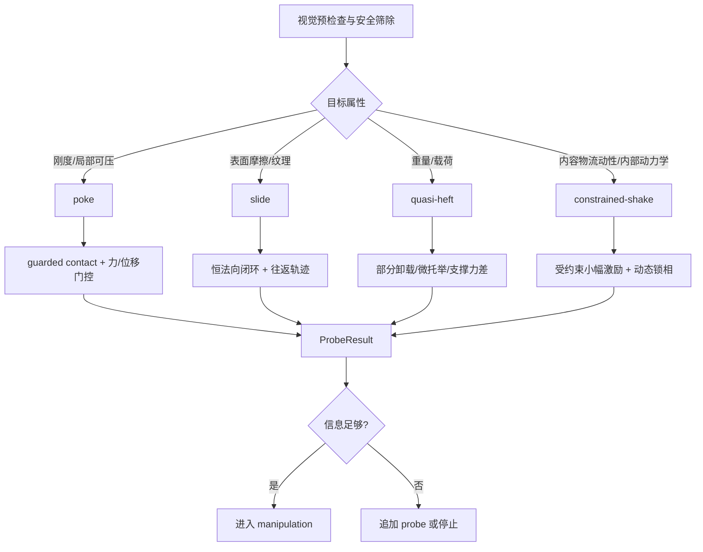

# 以触觉为核心的安全探询 Benchmark 设计与 Franka 接入分析报告

## 执行摘要

这份调研的核心结论是：**`poke` 与 `slide` 应当成为首版 touch-dependent benchmark 的主力原语，`heft` 与 `shake` 不应继续以“默认需要把物体真正托起并悬空”的形式作为通用原语，而应被重构为“受约束的安全探询协议”**。你当前仓库已经把 `heft`/`shake` 规范到了 **unsupported micro-lift / unsupported micro-shake**，并且对 Allegro 路线明确要求真脱离支撑、再做静态/动态测量；但同一仓库也明确承认当前执行后端仍是理想 6-DoF carriage，尚未包含真实机械臂的 IK、避碰、轨迹时间参数化与接触模式切换，因此“仿真中刚能做出来”的 unsupported micro-lift，并不能自然迁移到 `Franka + Allegro` 的安全、可复现实机协议上。仓库 0711 文档实际上已经把这个边界说得很清楚：Franka 接入不是换 XML，而是改写“从 wrist waypoint 到真实设备控制”的整条编译与执行层。citeturn29view0turn7view0turn3view1turn4view0turn4view2turn4view4

因此，工程上最稳妥的路线是：**先把 benchmark 的“物理语义”与“执行载体”解耦**。也就是说，保留动作名 `heft / shake / slide / poke`，但把它们定义为“获取某类触觉证据的协议”，而不是执着于人类式动作外观。例如：`heft` 不是“必须悬空掂一掂”，而是“通过安全受约束的卸载/受力变化获取重量相关证据”；`shake` 不是“必须托起后晃动”，而是“通过受约束的小幅动态激励获取内容物流动性或内部动力学证据”。这种改写并不违背你在 `docs/v1/main.md` 中提出的 benchmark 精神。该文档的核心不是拟人动作本身，而是围绕**视觉不可解、必须靠主动接触补足物理信息缺口**来构造任务，并把触诊代价纳入主指标。citeturn2view0turn3view0

具体建议上，我建议首版分成两层协议。**核心协议层**只保留 `poke` 与 `slide`，外加一个重写后的 `quasi-heft` 与 `constrained-shake`；**专家协议层**才保留当前仓库里的 unsupported micro-lift / unsupported micro-shake，仅面向“有凸缘、可 top pinch、刚性足够、可加安全夹具”的少数容器类对象。这样既能保住 benchmark 的 touch-dependent 设计，又不会让系统在桌面摆放、易碎目标、Franka 接入时反复被“必须托起”这个动作细节卡死。citeturn7view0turn8view0turn3view1

液体仿真方面，结论也很明确：**不建议把高保真液体自由液面仿真作为当前阶段的投入重点**。你仓库已经非常聪明地把 `fill` 默认 demo 设成 `content_mobility`，让 fixed / damped / mobile 三个对象拥有相同外壳、相同总质量、相同静态质心，只改变内部质量是否可动及阻尼，从而避免被 `heft` 用“重量捷径”直接解题。这种“等质量、同静态 CoM、只改内部动力学”的 proxy，本质上已经抓住了 benchmark 对 `shake` 这类动作真正需要的判别信息，而且和液体感知文献中“用 F/T 或动态触觉去看内部质心迁移与振荡衰减”的思路是一致的。控制和感知文献长期使用等效机械模型去近似 slosh；相反，完整液体建模虽然更真实，但观测、标定和跨容器泛化都很费力。对 benchmark 首版来说，更划算的路线是：**先用等质量 internal mobility proxy；若必须提高真实性，再升级为一到两个主模态的等效质点-弹簧-阻尼或摆模型；不要直接上 CFD/SPH/VOF 级别的高保真液体内环仿真**。citeturn29view0turn7view0turn23view3turn21search1turn27view1turn24view2

Franka 接入方面，最关键的不是“能不能跑起来”，而是**把 probe 和 manipulation 都纳入真实机械臂约束**。官方 FCI / libfranka 文档说明，控制回路运行在 1 kHz；控制线程需要严格满足时延与网络约束；Cartesian / joint motion 都必须满足位置、速度、加速度、jerk 与扭矩约束；碰撞阈值超过上界会直接触发停止。仓库 0711 文档则进一步指出：你现在的 `scene.command(x/y/z/roll/tilt/yaw)` 只是理想 wrist carriage，而不是 Franka；要落地到真机，必须补上 `ArmPlanCompiler`、IK branch 连续性、attach object 后的 planning scene 更新、接触前后控制模式切换、payload/adapter 补偿与 wrench 语义重标定。结论很简单：**如果不先把 ArmPlanCompiler + contact-mode executor 这一层搭起来，就不要试图把 unsupported `heft/shake` 直接宣称为“Franka 可执行协议”**。citeturn14view0turn16view0turn17view0turn22search3turn22search4turn3view1turn4view2turn4view3turn4view4

## 现有方案解读与核心判断

你当前仓库把 `AllegroProbe` 明确定位为 **ProbeBench 的 MuJoCo probe 执行层**，四个 family/primitive 的主要可信信号分别是：`poke` 对应法向力—压入量曲线与刚度估计；`heft` 对应脱离支撑后的 baseline-corrected 腕部力；`shake` 对应通过 `heft` gate 后的腕部力矩动态响应；`slide` 对应 preload 闭环下的切向/法向力比。四个原语统一走 `approach → guarded contact/descent → contact establishment → contact quality gate → primitive execution → post-check → retreat` 这套显式状态机。也就是说，从协议角度看，仓库本身已经在朝“版本化、可审计、可诊断”的 benchmark 执行层走，而不是纯 demo 脚本。citeturn29view0turn7view0

不过，`docs/v1/0711/franka_arm_integration_issues.md` 同时指出，当前系统最重要的真实前提是：手掌上游有六个彼此独立的 task-space 关节，`_move_wrist()` 只做 smoothstep 插值，不需要回答真实机械臂一定会遇到的一整串问题，包括 IK 是否存在、采用哪个肘部分支、是否靠近奇异位形或限位、轨迹是否撞桌/撞手/撞物、接触后是否继续位置跟踪还是切换阻抗/力控。因此它不是“简化版 Franka”，而是“理想任务空间执行模型”。这条判断非常关键，因为它直接解释了为什么当前 `unsupported_micro_lift` 在仿真里可行，但你一想到桌面场景、真手指摩擦、掉落风险、Franka 轨迹连续性，就会立刻觉得动作定义本身出了问题。citeturn3view1turn4view0

从 benchmark 设计目标看，这其实不是坏消息。`docs/v1/main.md` 的中心思想是：**构造一批“视觉/VLM 不可靠、必须主动触诊才能获得关键物理信息”的任务**，并用方法无关的 visual gap 与 oracle gap 去界定“非触不可”。这意味着，你真正要守住的是“必须依赖触觉信息”，而不是“必须模仿人类用某个具体姿势托举”。只要某个 probe 协议在不泄露视觉捷径、不过度编码夹具先验、并能稳定产生可复现的物理证据，它就仍然符合 benchmark 宗旨。citeturn2view0turn3view0

下面这张流程图，可以概括我建议的 probe 语义重构方式：



这套改法，也和主动触觉与交互式感知文献的普遍结论一致：触觉信息往往来自**受控接触、受控激励、以及对动态响应的建模**，而不是单纯来自“更大的动作”。`Tactile MNIST` 与 APPLE 强调主动选择触点与动作序列的重要性；早期 haptic exploration 文献也强调“部分手指稳定、部分手指滚动/滑动/探询”的分工；对于内部动力学物体，研究更是明确依赖**短时激励 + 力/振动/触觉响应**来获取信息。citeturn12search0turn12search1turn23view2turn24view0turn27view0

## Probe 动作集重构建议

下表把四个原语的**功能目标、当前冻结语义、失败模式与风险、以及建议的工程实现与参数范围**放在一起。表中的“当前仓库参数”来自 README 与 `probe_protocol_v2.md`；“建议参数范围”则是在这些已冻结值基础上，结合主动触觉/滑动/动态内容感知文献，对“未指定硬件”场景给出的**安全起始范围**。若末端执行器、触觉型号、最大夹持力、对象几何未明确，我在表中都显式标成了“未指定”。citeturn29view0turn7view0turn8view0turn25view0turn18search9turn23view2turn27view0

| 原语 | 目标物理属性 | 当前仓库冻结语义 | 主要失败模式与风险 | 建议的首选实现 | 建议参数范围 | 是否允许托举 | 是否需支架/夹具 |
|---|---|---|---|---|---|---|---|
| `poke` | 刚度、局部可压缩性、局部封口/弹性响应 | Allegro 路线已改为食指指腹触觉，不再使用中央 probe；默认目标/上限约 0.8 / 1.0 N，穿透上限 0.5 mm；只允许 `ff_tip_fingertip_collision` 与目标接触。citeturn7view0turn29view0 | 非目标指节或掌面先接触；法向不正；数值穿透；目标被推倒；桌面/邻物接触；对软/脆目标造成局部损伤。citeturn8view0turn29view0 | **保留为核心原语**。优先指腹或软头 probe，做受控法向 ramp；对于极脆物，改用更软接触帽或更低上限。 | 接触点：上表面或局部法向最稳定位置；法向力：**软指腹 0.2–1.0 N**，**刚性小探针 0.5–3.0 N**；压入速度：0.5–5 mm/s；位移：0.2–2.0 mm；保持：0.1–0.3 s；接触面：软指腹/软帽优先。该范围是针对“未指定触觉型号”的起始扫描范围。citeturn7view0turn25view0turn23view2 | 不需要 | 一般不需要；对易倒细长件可配侧向限位 |
| `slide` | 摩擦、表面材料、纹理、微观动力学 | 当前协议是 `round_trip_force_control`：先建立稳定 preload，再执行 `start→end→start` 的往返滑动；有效性依赖往返完成率、接触占比、无环境碰撞；路径完成率看实际 tip 位移，不看命令插值。citeturn7view0turn29view0 | preload 不稳导致跳跃； gross slip 把目标推走；接触丢失； probe 或手碰到邻物/桌面；不同方向非对称被误解为摩擦；表面软化、划伤或污染。citeturn7view0turn8view0turn18search9turn23view2 | **保留为核心原语**。接触面尽量选中高处平整区，做恒法向小载荷往返；用切向/法向比+方向不对称做特征，不追求长距离。 | 接触点：侧壁中上部或可重复平面区；法向 preload：**软指腹 0.2–0.8 N**，**刚性 probe 0.5–2.0 N**；滑动速度：5–30 mm/s；单程位移：10–30 mm；往返总时长：0.5–2.0 s；接触面：软垫或圆头 probe 优于尖头。对未知材料从低 preload 与短位移开始。citeturn7view0turn18search9turn23view2 | 不需要 | 推荐对易倒目标配浅槽/V 型座，但夹具不能暴露标签信息 |
| `heft` | 质量、载荷、重量等级、部分 CoM 线索 | 当前 canonical mode 是 `unsupported_micro_lift`：目标看物体几何中心真实抬升，默认 8 mm；最大 wrist travel 35 mm；向上速度 20 mm/s；需连续 120 ms 脱离支撑、80 ms 进入目标带；静态 200 ms hold；质量来自“支撑中 baseline → 抬升后受力”的重力轴投影。Allegro 默认 top-entry 中指—拇指 top-lip pinch。citeturn7view0turn29view0 | 桌面上 top pinch 难以稳定建立；掉落；抓取合法但不连续可达；手指摩擦不足；软/脆容器变形；真托举只带来安全风险而不是额外信息。citeturn7view0turn3view1turn4view2 | **不建议继续作为“通用桌面主原语”**。建议改成 `quasi-heft`：部分卸载、支撑力差、微托举或带仪器化支撑的 weight probe。仅对“有凸缘、可 top pinch、刚性足够、非易碎”的短罐类保留当前 unsupported 版本。 | 若保留 unsupported 专家协议：接触点为凸缘/把手；总对向法向力起始 **2–10 N**，上限按硬件额定值与目标脆弱性再定；真实中心抬升 **3–10 mm**；向上速度 **5–20 mm/s**；静态 hold **100–300 ms**；相对漂移阈值建议 ≤ 2–4 mm。若改成 quasi-heft，则目标改为“支撑反力降低 10–40%”或“支撑面明确卸载”。当前仓库并**未指定**不同真机上的最大可用法向力与安全夹持范围。citeturn8view0turn7view0turn4view5 | **核心协议不要求**；专家协议可允许微托举 | quasi-heft 推荐配仪器化 pedestal / load cell / shallow nest |
| `shake` | 内容物流动性、内部动力学、液位/黏度 proxy | 当前 canonical mode 是 `unsupported_micro_shake`：必须先通过同一 unsupported lift gate；单轴 tilt 3°、3 Hz；lift 后另采 200 ms dynamic baseline；分析用实际 wrist tilt 做 lock-in；每步检查目标最低碰撞几何距支撑面至少 1.5 mm；动态窗口内 wrist z 固定。citeturn7view0turn29view0 | 依赖先托起，掉落风险大；机械臂自振/相位延迟污染信号；与 `heft` 耦合太重；支撑净空不足；非密封容器洒漏；将 arm dynamics 错当成 content dynamics。仓库 0711 文档也明确指出接入 Franka 后 `dynamic_torque_gain` 的 calibration key 必须增加 arm/controller/mount/wrench source/posture 等因素。citeturn7view0turn4view3 | **建议改为 `constrained-shake`**。首选是受约束小幅动态激励：目标仍处在受控支撑中或处于部分卸载状态；固定支撑几何、激励幅频、姿态窗和 baseline 时机，从而抓取内部动力学证据，而不是靠悬空摇晃。 | 推荐起始值：**1–3°**、**1–4 Hz**、分析 1–3 个完整周期、每个 trial 总动态窗口 0.5–1.5 s；若保留 unsupported 专家协议，则沿用当前 3°/3 Hz 与底缘净空 ≥1.5 mm 的硬门限。对于真机，建议再加一个 arm-only 空载响应模板，用于做复数差分。citeturn7view0turn4view3turn27view0turn27view1 | **核心协议不要求**；专家协议可允许 | 推荐 shallow nest / side-stop / instrumented support；非密封容器应禁用 |

从整个 benchmark 的可实施性看，我的判断是：**动作语义要按“信息通道”定义，而不是按“托举外观”定义**。`poke` 与 `slide` 的信息通道比较纯，风险也容易局部化；`heft` 与 `shake` 的信息通道则天然混入抓取稳定性、几何可达性、掉落风险与机械臂动力学，因此更适合被改写成受约束协议。这个判断也和液体/内部动力学感知工作中常见的做法一致：研究者通常不会把“剧烈摇晃”当成唯一办法，而是利用**轻激励、静态保持阶段的 wrench 变化、或者受控扰动后的衰减特征**去估计内部属性。citeturn27view0turn27view1turn24view0

对于 `slide` 与 `poke`，我建议把安全终止准则单独固化，因为它们最可能成为首版 benchmark 的高频 probe。下表给出的是**建议写入协议**的停止与危险判定。其基本原则是：**一旦外界接触身份不纯、法向闭环失稳、目标整体运动超过“只应发生局部探询”的范围，就立即停**。这和仓库现有的“contact audit 全程有效性审计”方向是一致的，只是把工程标准进一步具体化了。citeturn8view0turn29view0

| 动作 | 应实时监控的量 | 建议立即停止条件 | 建议判为危险/无效的条件 |
|---|---|---|---|
| `poke` | 目标接触身份、法向力、力斜率、穿透、目标姿态变化、掌面/邻物/桌面接触 | 非合法接触 pair 出现；法向力超过上限；单位时间力增量异常尖峰；目标底部开始失稳；穿透超过阈值 | 非目标指节/掌面接触；桌面或邻物接触；目标整体位移超过约 1–2 mm 或倾角明显变化；触点法向漂移导致不再是“局部法向压入” |
| `slide` | 法向 preload 稳定性、接触连续性、切向/法向比、目标整体位移、回程误差、环境碰撞 | 连续失联超过短窗；法向闭环无法维持； gross slip 触发；邻物/桌面碰撞；目标转动开始放大 | 目标整体位移超过约 2–3 mm；回程误差超过单程的 10%；有效目标接触占比过低；切向力峰值已转化为推倒趋势而非摩擦响应 |
| `quasi-heft` | 支撑反力、腕部 wrench、对向接触合法性、相对滑移 | 卸载达到目标前出现滑移；握持法向力持续上升却无有效卸载；支撑重接触异常；安全 tether 拉紧 | 对向接触不合法；对象开始旋转/挤压变形；支撑反力与 wrist wrench 不一致，说明受力路径混乱 |
| `constrained-shake` | 激励角度与跟踪比、支撑接触状态、arm-only 响应模板残差、环境碰撞、容器姿态 | 超出幅值/频率窗；支撑净空不足；模板残差突然飙升；容器出现泄漏风险或上边缘液体外溢征兆 | 观测主要来自 arm resonance 而非对象；对象已脱离约束支撑；锁相 SNR 不达标且无法通过复测恢复 |

## Heft 与 Shake 的替代设计

你最关心的问题是：**桌面摆放下，`heft`/`shake` 的“托起”动作到底该怎么设置**。我的判断是：如果首要原则是“安全试探”，那就不应该再把“必须把物体托在掌心或稳定悬空”当成默认前提。更合理的做法，是把重量与内容物流动性的感知，转化成**局部可控、带外部支撑、可差分测量**的协议。重量估计文献本来就大量利用“抓持-支撑中 baseline 与 unsupported holding 差值”；内部动力学与液体感知文献也明确依赖受控扰动后的 F/T 或触觉响应，而不是依赖大幅度悬空摇晃。citeturn20view0turn20view1turn27view0turn27view1turn24view0

下面列出四种工程上可行、而且比“直接桌面托举”更稳妥的替代设计。前三种已经足够作为 benchmark 首版方案，第四种可作为面向容器类目标的专家协议补充。

| 替代方案 | 核心思想 | 实现步骤 | 所需传感器/执行器 | 优点 | 缺点 | 主要风险 | 安全缓解 |
|---|---|---|---|---|---|---|---|
| **部分卸载式 `quasi-heft`** | 物体保持在仪器化支撑上，机器人只承担部分重量；以支撑反力下降与 wrist wrench 上升的差分估计重量 | 物体置于小型 load cell / 6 轴 pedestal → top pinch 或侧夹建立合法接触 → 缓慢上拉/侧向卸载到支撑反力下降 10–40% → 保持 100–300 ms → 回落到原支撑面 | 仪器化 pedestal 或薄型 load cell；腕部 F/T 或 Franka 外力估计；基础触觉/关节力 | 不需要真正悬空；掉落风险最低；重量信号直接；很适合 benchmark 复现 | 额外硬件；支撑结构要统一；支撑反力会成为实验依赖项 | 支撑结构泄露先验；支撑摩擦污染数据 | pedestal 统一尺寸与表面材料；对象族共用支撑；记录支撑 profile ID；把支撑参数写入 sensor profile |
| **受约束动态激励式 `constrained-shake`** | 目标仍在 shallow nest / 低摩擦环 / side-stop 中，通过小幅姿态或横向激励获取内部动力学响应 | 建立轻夹持或侧向接触 → 保持目标在受控支撑中 → 执行 1–3°、1–4 Hz 的微激励或 step-like 侧扰 → 只在“停止/稳态后”或固定动态窗采 F/T/触觉特征 | 腕部 F/T、指尖触觉、可选加速度计；固定 shallow nest 或 side-stop | 不需要先通过 unsupported lift；对液体/松散内容物更安全；与动态触觉文献一致 | 支撑也会引入频响；要做 fixture-specific 标定 | 把支撑模式与内容动力学混淆；夹持不足导致对象在夹具中乱撞 | 固定支撑几何；先录 arm-only 与 empty-container 模板；动态窗内不再改 z；只比较同 fixture/profile 下的相对特征 |
| **倾斜-滑动联合 probe** | 不通过上提，而通过受控倾斜或小横移，让重量在支撑面和夹持点之间重新分配；同时观察 slip onset 与 wrench 变化 | 目标置于低摩擦垫或小倾台 → 侧向轻夹/顶部轻夹建立约束 → 缓慢倾斜或微横移 → 记录支撑摩擦、切向/法向比、腕部力矩变化 → 回到初位 | 倾台或小线性台；腕部 F/T；接触检测；可选视觉 | 硬件简单；很适合把 `heft` 与 `slide` 结合成更安全的“载荷-摩擦联合探查” | 重量与摩擦耦合；解释不如 load-cell 直接 | 对目标整体位移更敏感；易把桌面摩擦当成内容属性 | 仅用于“重量等级/稳定搬运风险”而非绝对质量；统一支撑材料；严格限制位移和倾角 |
| **专家协议下的微托举 + 安全防坠** | 保留当前 unsupported micro-lift，但只面向短罐/凸缘容器，并配防坠与局部支撑设计 | 为目标增加 shallow ring 或 safety tether → top-entry pinch 建立合法对向接触 → 微托举 3–8 mm → 静态/动态窗测量 → 放回原支撑面 → release | 腕部 F/T、指尖触觉、浅支撑环或 tether | 保留当前仓库语义，和既有代码最接近 | 泛化差；对对象几何挑剔；真机难度最高 | 掉落、夹坏凸缘、Franka 自振污染 | 仅列为专家协议；对象族限制为 rigid sealed short-can；与 core leaderboard 分榜 |

如果只选一个最优先落地方案，我推荐**部分卸载式 `quasi-heft`**。原因很简单：它最接近当前 `heft` 的物理目标，却最不依赖 finger-pad 摩擦与悬空稳定性；而且它天然适合通过 `support_reaction_before / after` 与 `wrist_wrench_before / after` 做差分，信号解释清晰，掉落风险最低。对真实 Franka 系统来说，这种差分也最容易和 `setLoad`、姿态相关重力补偿、外力估计做一套标准化标定。citeturn20view0turn20view1turn14view0turn14view1turn4view3

如果你更想尽快保留 `shake` 的“内容物流动性”能力，我推荐**受约束动态激励式 `constrained-shake`**。原因在于，液体/内部动力学感知文献已经明确指出：真正有效的信息通常来自**短时激励后的衰减频率、阻尼、相位与高频响应**。其中一些工作甚至直接建议用“step response”或激励后保持静止阶段的数据，而不是持续大幅摇晃，因为后者会引入更复杂、非线性的流体现象和更脏的信号。对 benchmark 来说，这意味着只要把激励和采样窗口定义清楚，`shake` 完全没必要坚持“先悬空再摇”。citeturn27view0turn27view1turn24view0

## 液体仿真的取舍与推荐路线

关于“液体仿真是不是吃力不讨好”，结论是：**在你当前这个 benchmark 阶段，基本是的**。理由有三层。

第一层，从 benchmark 目标看，你真正要证明的是“某类任务必须靠触觉主动探询才能解”，而不是“机器人已经把自由液面流体学真实地模拟出来了”。`docs/v1/main.md` 把 benchmark 灵魂定义为 visual gap、物理真值、主动触诊与信息效率，而不是液体仿真 fidelity。只要你能把“内部内容物是否可动、动态响应是否不同、这些差异是否必须通过触觉/力觉获取”这件事做成干净、可重复、可统计的任务，benchmark 就成立。citeturn2view0turn3view0

第二层，从你现有仓库实现看，你其实已经走在更合理的简化路线了。README 与 `probe_protocol_v2.md` 都说明，默认 `fill` demo 不是直接做 fill-ratio，而是 `content_mobility`：fixed / damped / mobile 三个不透明密封容器具有**相同外壳、相同总质量、相同静态填充率、相同内部质量、相同静态质心和相同关节范围**，只改变内部质量是否可动及阻尼；这样可以避免 `heft` 用“重量差”偷看出答案，只让 `shake` 这类动态 probe 去感知内部动力学。这是一个非常好的 benchmark-first 设计，因为它把任务难点压缩在“触觉必须看到的那部分物理差异”上。citeturn29view0turn7view0

第三层，从文献与工程经验看，液体内部动力学长期就不是靠“全 CFD 才能用”。NASA 的 slosh handbook 早就把**等效机械模型**作为设计与控制分析的重要工具；后续控制文献也一直把摆模型、质点-弹簧-阻尼模型当作主流近似。针对机器人液体感知的工作，同样常常依赖**wrist F/T + 小幅旋转/扰动**去看内部质心迁移，而不是先把自由液面精确算出来。反过来，高保真液体建模确实能更真实，但观测、标定、容器几何泛化和算力开销都很重；而且有论文明确指出，即便是 physics-based simulation-informed liquid perception，也依然面临“如何从真实数据中高效观测这些参数”的难题。citeturn23view3turn21search1turn27view1turn24view0turn24view2

基于这些考虑，我建议把液体/内容物建模策略分成四档：

| 策略 | 建模内容 | 实现复杂度估计 | 对 benchmark 有效性的影响 | 推荐等级 |
|---|---|---:|---|---|
| **不模拟液体** | 核心榜单不含液体类，只做刚度/质量/摩擦/内部固体可动件 | 低 | benchmark 更聚焦，但会失去“内部动态内容物”一类任务 | 可作为最保守起点 |
| **等质量 internal mobility proxy** | 维持相同总质量与静态 CoM，只改内部质量可动性与阻尼；与你当前 `content_mobility` 一致 | 低到中 | 对“是否有内部动态响应”最划算；非常适合首版 benchmark | **强烈推荐** |
| **一到两个主模态的等效机械模型** | 用摆模型或 mass-spring-damper 近似主要 slosh mode；可输出频率、阻尼、相位 proxy | 中 | 比 internal mobility proxy 更接近液体动力学，但仍可解释、可校准 | **次推荐** |
| **高保真液体仿真** | CFD / SPH / VOF / 复杂 PBD 自由液面 | 高 | 真实性最高，但研发成本、标定成本、算力成本都高，且未必提升 benchmark 核心判别力 | 当前阶段不推荐 |

我的推荐方案是：**首版 leaderboard 核心任务使用当前 `content_mobility` proxy；若后续一定要把“液体”写进任务名录，则仅升级到“一到两个主模态的等效机械模型”，并把它解释为“liquid-like internal dynamics benchmark”，而不是“高保真液体现实模拟”**。这样做的好处有四个：  
其一，能继续维持你现在“等质量，不给 `heft` 走捷径”的漂亮设计。citeturn29view0turn7view0  
其二，能直接与 `shake` / `constrained-shake` 的幅频协议对上，因为等效模型天然输出频率、阻尼和相位。citeturn23view3turn21search1turn27view0  
其三，能显著降低对容器真实几何、开口泄漏、自由液面破碎等复杂现象的依赖。citeturn27view1turn24view0  
其四，和近期“低成本、任务导向液体感知”的工程趋势一致：例如有工作直接把液体理解放到标准化、低成本、机器人外的测试单元里再映射到仿真，而不是强行让机械臂在线精确模拟每一种液体。citeturn24view2

因此，在你的报告和协议里，我建议明确写一句：**“液体高保真仿真不是 v1 的重点；v1 目标是建立 touch-dependent、可安全执行、可稳定分辨的内部动力学 probe 任务。”** 这句话在学术与工程上都站得住。citeturn2view0turn29view0turn27view1

## Franka 接入工程对策

仓库 0711 文档已经把 `Franka + Allegro` 接入问题分解得相当完整了。我这里不再重复原文，而是把它整理成**问题—对策—接口—验收**四元表。核心原则只有一句话：**把现有 `ManipulationPlan` 视为 skill-level 语义，把真实 Franka 执行看作一个独立的 `ArmPlanCompiler + PhaseExecutor` 子系统**。这与 0711 文档建议的数据流是一致的，也与官方 libfranka 的接口边界一致。citeturn4view4turn14view0turn14view2

| 0711 文档问题 | 工程后果 | 建议对策 | 必要接口/软件 | 验收标准 |
|---|---|---|---|---|
| 理想 6-DoF carriage 不是 Franka | 当前 wrist waypoint 不等于真实 arm 可达轨迹 | 新增 `ArmPlanCompiler`，把 skill waypoint 编译成 IK 集合、连续 joint path、时间参数化轨迹；保留 carriage 仅作 regression backend | `libfranka` 或 `franka_ros2`；IK 求解器；MoveIt 2 或自研 collision-aware planner；`ArmPlanResult` | 同一个 plan 在可达性、分支连续性、避碰、时间参数化上全部通过；不可达 plan 明确拒绝，而不是硬执行 citeturn4view0turn4view2turn4view4turn14view0 |
| flange→adapter→palm 变换未定义 | 所有现有 `T_object_wrist`、力矩 frame、top-entry 语义都可能错 | 固化 `T_franka_attachment_allegro_palm`；在仿真和实机统一 adapter 质量、惯量、碰撞代理；所有抓取模板重标定 | `setEE` 设置末端 frame；CAD/URDF/MJCF 统一 adapter；统一 frame 文档 | FK 与独立几何计算一致；相同对象在 sim/real 的 palm 朝向误差在可接受范围内 citeturn4view1turn14view0 |
| Panda 与 Allegro 模型合并会有 asset/default/geom 冲突 | MJCF 可编译但物理与碰撞含义错 | 单独整理 model merge 层；统一 default class、solver、asset 路径与碰撞 exclude；绝不保留 carriage+Franka 双重自由度 | MuJoCo Menagerie 模型整理；命名检查脚本 | 编译后 joint、site、geom 唯一；碰撞角色与预期一致；无“看见但无碰撞 proxy”的 link citeturn4view1turn8view0 |
| 一个 waypoint 可能零解、多解，且相邻 phase 易跳 branch | 轨迹不连续、急甩、接触前失稳 | candidate ranking 中加入 `ik_solution_count / min_joint_limit_margin / manipulability / self-collision distance / env clearance / path length`；按“全 phase 可连续可达”而不是单点可达收 candidate | IK 求解器、branch continuity checker、可达性缓存 | pregrasp→grasp→lift→carry 不发生 branch 跳变；遇奇异/近限位明确淘汰候选 citeturn4view2 |
| `_move_wrist()` 的 Cartesian 插值不等于无碰撞轨迹 | 肘部、前臂、手背、被抓物会扫到桌/邻物 | 自由空间用 joint-space 规划；接触附近用短程 Cartesian 约束轨迹； grasp 后对象要 attach 到 planning scene | MoveIt 2 / 自研 planner；scene attach/detach | staging / pregrasp / grasp / lift / carry / place / retreat 各 phase 都有对应 planner 语义；抓后 carry 时对象碰撞能被正确检查 citeturn4view2 |
| 当前时长由 `min_steps` 等仿真量决定 | 实机会违反 jerk/acc/vel/torque 约束 | 所有轨迹都要做时间参数化，满足官方 limits；接触阶段要再降低速度与 jerk | FCI robot limits；时间参数化器；`limit_rate` / low-pass 仅作最后保护，不作主要规划手段 | 不触发 joint/cartesian velocity/acc/jerk discontinuity；起止速度、加速度为零或接近零 citeturn16view0turn22search0 |
| wrist wrench 语义改变 | 现有 `heft`/`shake` 标定失效 | 明确 wrench 来源：独立 6 轴 F/T、Franka external wrench estimate 或两者融合；定义 frame、带宽、bias、温漂与 payload 补偿链路 | `RobotState` 中外力相关状态；`setK`、`setLoad`；独立 F/T 驱动 | 空载/挂手/挂 adapter/挂对象时 baseline 可重复；不同姿态下重力补偿后残差在设定范围内 citeturn4view3turn14view1turn14view0 |
| `shake` 极易被 arm 本体动力学污染 | dynamic gain 不再只反映内容物 | 必须新增 `arm-only`、`tool-only`、`empty-container` 三类模板；结果做 profile-specific 差分；如果没有 profile 标定，不应输出可比较的 `shake` 特征 | 统一 calibration key；空载模板采集；版本化 `sensor_profile_id` | 同 profile 下 locked / damped / mobile 可分；跨 posture 仍能维持统计可分性，否则此 profile 不进入 benchmark capability citeturn4view3turn7view0 |
| phase transition 目前没有统一 executor | arm 与 hand 不同步，安全停机链路断裂 | 统一 `PhaseExecutor` 管 arm trajectory、hand target、guarded contact、stop/cancel、result aggregation | 高层状态机；手/臂同步 stop 接口；错误传播 | cancel 延迟、mode switch 失败、Franka reflex/error、手停机等都能进入统一 `ManipulationExecutionResult` citeturn4view4turn4view5 |

在软件与控制接口上，我建议采用如下最小集合。**自由空间**阶段用 `control(motion_generator_callback, controller_mode=...)` 的 Cartesian pose/velocity 或 joint trajectory 模式，底层保持关节/笛卡尔阻抗；**接触附近**阶段切换到更软的 Cartesian impedance，并把触觉/腕部 F/T 作为 guarded gate；**必要时**，再用 torque-level controller 做极小幅的接触调节，但不要一上来就把所有 probe 都写成纯 torque control。官方文档说明，libfranka 提供 joint / Cartesian motion generator 与 torque-level control 的组合接口；`setCartesianImpedance`、`setK`、`setEE`、`setLoad`、`setCollisionBehavior` 等接口都应该成为 probe executor 初始化的一部分。citeturn14view0turn14view1

实时性方面，官方要求非常严格：FCI 工作在 **1 kHz**，工作站推荐 Linux + PREEMPT_RT，最好直接连到 Control 的 LAN 口；RTT + 用户控制回路执行时间 + 机器人内部处理时间的总和必须 **小于 1 ms**；如果连续 20 个周期数据包被丢弃，机器人会触发 `communication_constraints_violation` 停止。官方 troubleshooting 还特别指出，1 kHz 控制循环里 read/write 间隔应在 **500 µs** 内完成，不能在循环里动态分配内存、打印日志、sleep 或加载模型。对 benchmark 这种高频探询系统，这些不是优化建议，而是系统是否可用的硬约束。citeturn17view0turn15search0turn22search3turn22search4

这也意味着，建议把控制栈分成三个频段：  
高层策略与试验编排：20–100 Hz；  
轨迹/phase 管理：100–200 Hz；  
接触执行与 safety gate：1 kHz。  
其中 1 kHz 回路只做**确定性的小逻辑**：读取 `RobotState`、读取触觉/F/T、评估 stop gate、输出下一拍命令。复杂的 IK、规划、日志格式化、模型加载都必须放到非实时层。这个拆法与官方 best practice 以及 0711 文档想要的 `PhaseExecutor` 很一致。citeturn15search0turn4view4

最后，0711 文档列出的“接入前必须明确的外部条件”必须原封不动地变成项目里程碑前置项：**到底是 Panda 还是 FR3；只做 MuJoCo 还是要上实机；真实安装变换与 adapter CAD/惯量；wrench 来源；自由空间与接触阶段各用什么控制器；采用哪套 IK/规划栈；世界/桌面/相机/frame 的标定；是否允许 Franka 专属 probe protocol 与 calibration**。这些条件若不先冻结，后面所有 `heft/shake` 对策都会落在流沙上。citeturn4view5

## 实验设计与最小可复现集

从实验设计角度，首版 benchmark 最重要的不是对象数量，而是**对象族的“视觉近似、物理不同”**与**摆放/夹具不泄露答案**。这正对齐了 `docs/v1/main.md` 的最初目标，也与当前仓库对 fixed / damped / mobile 的等质量方案一致。换句话说，摆放系统可以帮助安全执行，但不能把隐藏标签通过支撑几何偷偷暴露出来。citeturn2view0turn29view0turn7view0

我建议把物体摆放分成三类：  
一类是**桌面直放**，专供 `poke` 与 `slide`。  
一类是**浅支撑/仪器化 pedestal**，专供 `quasi-heft`。  
一类是**shallow nest / side-stop / 低摩擦环**，专供 `constrained-shake`。  
这样做的好处是，每个 probe 的接触几何与风险边界都更清晰，数据也更利于归因。对桌面类对象，支撑不应超过底部周边 10–20% 的有效可见区域；对仪器化 pedestal，支撑材质、表面粗糙度、尺寸和 profile ID 必须统一记录；对动态夹具，应该把 fixture 作为 sensor profile 的一部分写进日志。citeturn29view0turn7view0turn4view3

传感器布局方面，我建议一开始就把**触觉、wrist F/T、基础视觉**三者都留出接口，但把主榜单按 tier 分开。你的主文档已经提出“全触觉 / 仅力矩 / 声学代用”等分层思路，这非常合理。对于 Allegro，我建议优先在用于 `poke` 的食指指腹与用于 pinch 的拇指/中指保留触觉接口；对于 Franka，wrist 侧建议二选一：独立 6 轴 F/T 最稳妥，Franka external wrench estimate 最易接入，但二者语义和漂移特性不同，不能混成一个 calibration。视觉相机则只负责 object pose、environment clearance 与安全录像，不允许把隐藏标签线索泄露给策略。DIGIT 这类视触觉传感器的优点是体积小、适合 Allegro、多指兼容，而且文档明确提到可估计接触几何和在带 marker 情况下估计剪切信息；这对 `poke`/`slide` 很有用，但如果当前硬件未指定，也完全可以先只保留安装接口。citeturn3view0turn25view0turn4view3

数据记录项方面，我建议日志最少包含以下字段：  
`episode_id / object_family / object_variant / placement_profile / sensor_profile_id / primitive / mode / target / valid / violations / phase_reached / timestamps / T_world_object / T_world_wrist / hand_q / arm_q / tactile_summary / wrist_wrench / support_reaction / contact_pairs / max_penetration / safety_stop_reason / feature_dict / raw_trace_pointer`。  
如果是动态 probe，还要单独记录 `baseline_window`, `analysis_window`, `arm_only_template_id`, `fixture_profile_id`。这些字段基本都能和你当前 `ProbeResult`、`ManipulationExecutionResult`、0711 文档建议的 `ArmPlanResult` 接上，不需要另起炉灶。citeturn29view0turn7view0turn4view4

评价指标上，建议把**安全性**从附属指标提升为与成功率并列的一等指标。首版最低限度应包含：  
`success_rate`：目标属性或下游操作是否完成；  
`safety_rate`：无非法接触、无掉落、无超力、无危险停止；  
`information_gain` 或代理指标：probe 后不确定性下降多少；  
`probe_cost`：时间、probe 次数、接触能代理项；  
`object_damage_rate`：破坏或永久塑性变形比例；  
`drop_rate`：掉落比例；  
`feature_valid_ratio`：有效 probe 比例。  
如果要和 `main.md` 的 PAU 理念接轨，就把 `safety_rate` 与 `feature_valid_ratio` 当成 PAU 的前置 gating，而不是后置备注。citeturn2view0turn3view0turn29view0

下面给出一个**最小可复现实验集**，覆盖刚度、摩擦、重量、内部动力学四类核心需求。尺寸、质量等参数是**建议设计值**，不是在引用某个商业产品规格；目的在于让对象族内部“视觉近似、物理不同”，同时避开过度复杂的异形抓取。

| 物体代号 | 建议尺寸 | 建议质量 | 材质/内部结构 | 易碎性 | 是否含液体 | 推荐摆放 | 推荐 probe 序列 |
|---|---:|---:|---|---|---|---|---|
| `rigid_can_A` | 直径 66 mm，高 120 mm | 0.18 kg | 不透明刚性圆柱壳，内部固定配重 | 低 | 否 | 桌面直放；也可放仪器化 pedestal | `poke` 省略，`quasi-heft` → `constrained-shake` 或直接 manipulation |
| `mobility_can_B_fixed` | 同上 | 0.18 kg | 同外壳、同总质量、内部固定质量块 | 低 | 否 | shallow nest 或侧限位 | `quasi-heft` 可选 → `constrained-shake` |
| `mobility_can_B_damped` | 同上 | 0.18 kg | 同外壳、内部低频可动质量块，高阻尼 | 低 | 否 | shallow nest 或侧限位 | `constrained-shake` 主 probe，必要时短 `slide` 看壳体表面一致性 |
| `mobility_can_B_mobile` | 同上 | 0.18 kg | 同外壳、内部低频可动质量块，低阻尼 | 低 | 否 | shallow nest 或侧限位 | `constrained-shake` 主 probe |
| `foam_box_C_soft` | 50×50×50 mm | 0.06 kg | 视觉近似的软泡沫块 | 中 | 否 | 桌面直放 | `poke` → `slide` |
| `block_C_hard` | 50×50×50 mm | 0.06–0.10 kg | 视觉近似的硬橡胶/塑料块 | 低 | 否 | 桌面直放 | `poke` → `slide` |
| `sealed_bottle_D` | 直径 60 mm，高 150 mm | 0.22–0.30 kg | 密封不透明塑料瓶，可替换为等效内部动力学 proxy | 中 | 可选“液体样” | shallow nest + side-stop | `constrained-shake`，不建议 unsupported 空中 shake |
| `fragile_cup_E` | 口径 75 mm，高 90 mm | 0.02–0.05 kg | 薄壁纸杯/薄塑杯 | 高 | 可选 | 桌面直放 + 外围防倒圈 | 只允许低力 `poke` / 低 preload `slide`；禁止 `heft/shake` |

在这些对象之上，我建议再定义一个简洁的标注格式。比如：

```json
{
  "episode_id": "pb_v1_000123",
  "object_family": "content_mobility",
  "object_variant": "mobile",
  "placement_profile": "nest_v1",
  "sensor_profile_id": "allegro_ff_tip+wrist_ft+cam_top",
  "primitive": "constrained-shake",
  "mode": "supported_micro_excitation_v1",
  "target": 1,
  "labels": {
    "mass_class": "medium",
    "content_mobility": "mobile",
    "stiffness_class": null,
    "surface_material": "painted_metal"
  },
  "safety": {
    "valid": true,
    "violations": [],
    "max_illegal_penetration_m": 0.0,
    "drop": false,
    "damage": false
  },
  "features": {
    "dynamic_gain": 0.42,
    "dynamic_phase": -0.31,
    "snr_db": 19.8
  }
}
```

这个格式的关键是两点。第一，**把 placement / sensor / mode 全部版本化**，否则同一个动作在不同 fixture 或不同腕部力源下就不可比。第二，**把“安全失败”和“物理 feature 无效”单独编码**，不要用零值冒充探询结果。你当前 `ProbeResult` 的设计已经朝这个方向做了，建议直接延续。citeturn29view0turn7view0

## 参考资源

最后给出一份**按优先级排序**的参考资源清单。排序逻辑是：先看你自己的协议与边界文档，再看 Franka 官方接口与控制限制，再看最直接对应的主动触觉、液体/内部动力学感知文献。这样最能支撑工程实施。

| 优先级 | 资源 | 用途 | 关键价值 |
|---|---|---|---|
| 高 | 你仓库的 `docs/v1/main.md` | benchmark 设计总纲 | 明确了 visual gap、物理真值、PAU 与“非触不可”的设计原则。citeturn2view0turn3view0 |
| 高 | 你仓库的 `docs/v1/0711/franka_arm_integration_issues.md` | Franka 接入边界 | 明确指出 carriage 不是 Franka，接入需要重写编译/执行层，而不是换 XML。citeturn3view1turn4view0turn4view1turn4view2turn4view3turn4view4turn4view5 |
| 高 | 你仓库的 `README.md` 与 `docs/v1/0710/probe_protocol_v2.md` | 当前四原语冻结协议 | 给出了 `poke/heft/shake/slide` 的 canonical mode、当前 gate、有效性与 feature 语义。citeturn29view0turn7view0 |
| 高 | Franka 官方 FCI / libfranka 文档 | 实机控制与安全限制 | 1 kHz 回路、控制模式、collision behavior、stiffness frame、payload 设置、limits 与网络/实时要求都在这里。citeturn14view0turn14view1turn16view0turn17view0turn15search0 |
| 高 | `Tactile MNIST` 与 APPLE | 主动触觉 benchmark 与策略参考 | 提供“主动触觉基准”和“动作选择策略”层的外部参照。citeturn12search0turn12search1turn12search5 |
| 高 | `VTDexManip` | 视触觉灵巧手 benchmark 参照 | 可用来比较“被动视触觉 dex manipulation”与“主动 probe→manipulation 闭环”的差异。citeturn12search6 |
| 高 | Okamura 等关于 rolling/sliding 的经典工作 | `slide` 的动作设计基础 | 强调“部分稳定、部分探索”的触觉探索思想，很适合你把 slide 作为核心原语。citeturn23view2 |
| 高 | Chen 等 friction / incipient slip 综述 | `slide` 安全阈值与失效检测 | 支持把 preload、incipient slip、gross slip 与剪切变形作为摩擦 probe 的中心信号。citeturn18search9turn18search20 |
| 高 | Azevedo 等与相关重量估计工作 | `heft/quasi-heft` 的差分思路 | 支持“抓取/抬升/holding 差分估重量”的基本工程思路。citeturn20view0turn20view1 |
| 高 | Berkeley 2019/2021 关于容器内液体的 haptic perception | `shake/constrained-shake` 的理论基础 | 明确用 wrist wrench、静态/动态阶段与简化模型去估计 mass/volume/viscosity。citeturn27view1turn24view0 |
| 高 | RSS 2022 `Understanding Dynamic Tactile Sensing for Liquid Property Estimation` | 动态触觉如何简化液体感知 | 用受控扰动与自由振荡特征估计液体性质，说明不必依赖持续大幅摇晃。citeturn27view0 |
| 中 | NASA slosh handbook 与等效机械模型资料 | 液体简化建模 | 支持用等效机械模型替代高保真流体内环仿真。citeturn23view3turn21search1 |
| 中 | DIGIT / GelSight 官方资料 | 触觉传感器选型参考 | 说明其体积、开放性、与 Allegro 的兼容性，适合你后续做指尖触觉配置。citeturn25view0turn25view1 |

综合起来，**最值得马上执行的工程步骤**可以概括为一句话：  
先冻结 `quasi-heft` 与 `constrained-shake` 的 v1 协议，保住 `poke/slide` 的核心榜单；同时把 `Franka + Allegro` 的接入工作限定为“ArmPlanCompiler + PhaseExecutor + wrench/calibration 重构”，而不是继续在 unsupported 托举这个动作外观上纠缠。这样，你的 benchmark 会更安全、更可复现，也更符合“必须依赖触觉”这个真正的学术目标。citeturn2view0turn29view0turn3view1turn7view0turn4view5