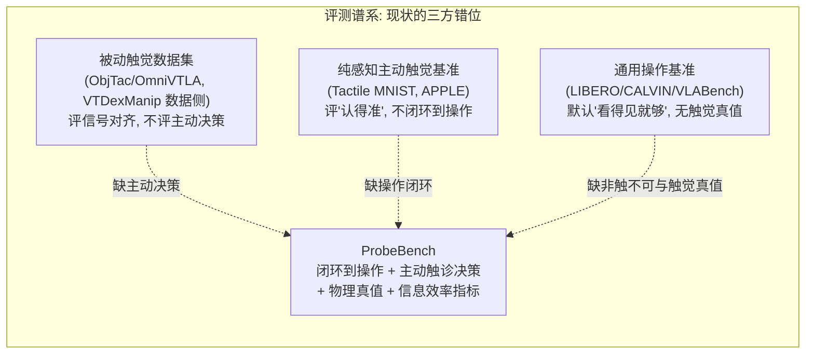
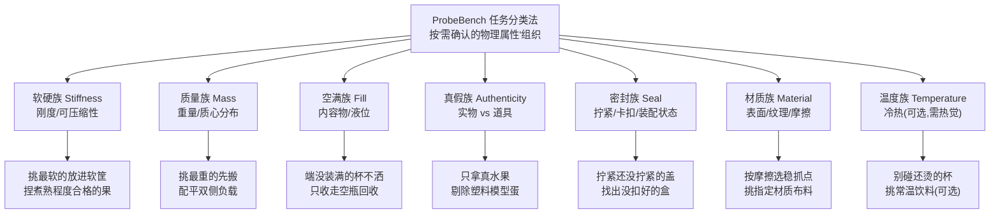

# ProbeBench 细化方案：主动触觉探询驱动操作的标准基准

> 一句话定位：**第一个以"主动触诊 → 下游操作"闭环为评测对象的灵巧手基准**——专门构造一批"单凭视觉/VLM 无法可靠完成、必须主动触诊才能判断"的任务，配套物理属性 ground-truth、仿真+真机双协议，以及一个把"触诊代价"纳入考量的**信息效率—成功率综合指标 (PAU)**。

---

## 1. 标题与定位

- **标题（暂定）**：ProbeBench: A Benchmark for Active Tactile Interrogation in Dexterous Manipulation —— Tasks, Physical-Property Ground Truth, and Information-Efficiency Metrics
- **一句话定位**：给"会主动用手问世界的灵巧手"造一把统一的尺子——把"非触不可"的任务、物体的物理真值、以及"用了几次触诊才问明白"的代价，全部标准化、可复现、可横向对比。
- **系列位置**：ActiveTouch（系列 01）的**基准/数据地基**。它明确"哪些任务非触不可""怎样算成功""信息效率怎么量"，使主动触诊从"各做各的 demo"变成"可被反复刷分、可被审稿人复核"的研究对象。

---

## 2. Motivation

### 2.1 核心张力：视觉天花板很低、触觉天花板很高的一类任务，恰恰没有尺子

机器人操作的"成功"高度依赖对物体**物理属性**（刚度、质量与质心、内容物/液位、真伪、密封状态、表面摩擦）的正确判断。这些属性的共同特点是：

- **它们决定操作策略**：端一杯没装满的水和端一杯满水，所需倾角与加速度上限完全不同；抓一块石膏和抓一块同色海绵，所需夹持力差一个量级。
- **它们大多是"体属性"或"力学状态"，在常规相机视角下不可观测或可被伪装**：刚度是体属性，质量/质心藏在外壳内，液位被不透明杯壁遮挡，仿真水果可在纹理上乱真，密封是需要施力才显现的力学状态。

也就是说，存在一大类任务，其**视觉可达成功率天花板很低、而一旦获得物理真值天花板很高**——中间的"信息缺口"只能靠**主动接触**去填。人类面对这类任务的本能是"先掂一掂、捏一捏、晃一晃再决定怎么做"，这正是主动触诊（active tactile interrogation）。

问题在于：**学界想证明"主动触诊有价值"，却没有一把公平的尺子。** 这是 ProbeBench 要补的核心缝。

### 2.2 三方错位：现有评测体系为什么都量不到"主动触诊驱动操作"

将现有评测资产沿两个轴铺开——**是否闭环到下游操作** × **是否评测主动决策（何时/如何制造接触）**——会看到一个清晰的空洞：



- **被动触觉数据集只管"信号对齐"**：以 ObjTac（随 OmniVTLA，arXiv:2508.08706）为代表，提供视-触-语义对齐的三模态样本，服务被动融合表征；VTDexManip（ICLR 2025）虽进到灵巧手操作，但触觉是**被动**注入策略（二值/稀疏信号融合可提升约 20% 成功率），不评测"主动决定何时、如何去制造接触"。在这类资产上刷高分，无法证明"主动性"本身有价值。
- **纯感知主动触觉基准只管"认得准"**：以 Tactile MNIST（arXiv:2506.06361）及其上的方法 APPLE（ICLR 2026，arXiv:2505.06182）为代表，评测的是主动探索下的分类/计数/位姿/体积**估计精度**，**不闭环到下游操作**。一个能 100% 认出"这是空罐"的系统，未必能"因此把它稳稳端起来不洒"——而后者才是机器人要交付的。
- **通用操作基准默认"看得见就够"**：LIBERO、CALVIN、VLABench（ICCV 2025，arXiv:2412.18194）等任务设计以视觉/语言推理为主，纯视觉 VLA 即可刷分。主动触诊在这些基准上**没有用武之地，也就无法体现优势**。

**错位的本质**：三类基准各缺一块拼图（被动缺主动决策、纯感知缺操作闭环、通用操作缺触觉决定性与真值），导致"主动 vs 被动 vs 纯视觉"的对比**无法在任何单一现有基准上干净地做出来**。

### 2.3 "非触不可"是基准的设计灵魂（可量化的入选判据）

一个任务要进 ProbeBench，必须通过一道**可解性筛子**——我们将其形式化为一个**信息缺口门槛**。为避免"基准被造得专门让作者方法获胜"的循环论证（benchmark–method 共谋），**入选判据完全用与任何待评测学习型方法解耦的参照来界定**：

> **入选判据（Visual-Gap Gate，方法无关）**：
> - 令 `TSR_vis` = 一族**充分训练、给定固定算力/数据预算的当代 SOTA 纯视觉 VLA**（在论文中列明具体模型与训练协议）在该任务上的**成功率上包络**（报分布而非单点）；
> - 令 `TSR_oracle` = 给定物理真值属性 `z*` 条件化后、用同一操作策略族取上包络的成功率；
> - **信息缺口**：`Gap_task = TSR_oracle − TSR_vis`，要求其 **95% CI 下界 ≥ τ_gap**；
> - **触诊可达性**（缺口确能被触诊填）：用**方法无关的参照策略**——"Oracle 之外允许任意多次探测的**穷举触诊上界**"或"**人类遥操**"——验证存在策略使 `TSR ≥ TSR_vis + δ`。**绝不用 ProbeCoT 等被测方法来证明可达性。**

**阈值与隔离协议**：默认 `τ_gap = 0.4`、`δ = 0.25`，但二者**非内禀常数**而是可复算脚本的参数，§5.4 对 `τ_gap ∈ {0.3,0.4,0.5}`、`δ ∈ {0.15,0.25,0.35}` 做敏感性，证明任务集与结论对阈值稳健。任务集在**跑任何方法榜单之前冻结**（selection 与 evaluation 时间/数据隔离），并保留一批**未参与筛选的 held-out 任务族**用于预注册假设复测（§5.5）。

**时效性声明**：`Gap_task` 是**相对当代视觉基线的相对量**——视觉模型变强会缩小缺口。因此基准随基线刷新而**重标**，并以脚本而非冻结数字发布，这恰是"非触不可"诚实可复核的体现。

这条筛子保证基准不是"又一个操作任务集顺手加了触觉"，而是**结构上逼迫 agent 去主动触诊**：缺口太小（视觉本就能解）的任务被剔除；缺口存在但触诊也填不动（属性不可辨）的任务同样剔除。

> 这把"非触不可"从一句口号变成了**可被审稿人复核的量化门槛**——这是本基准相对"顺手加触觉"类工作的关键区别。

### 2.4 为什么是灵巧手、为什么现在

- **结构性差异化（只有灵巧手能承载）**：能"先问再抓""单指局部触诊不改变全局状态""手内换指多视角探询"的只有多指灵巧手；平行夹爪一夹就改变/破坏状态（捏满杯即洒、夹软果即损），无法承载本基准的核心任务。因此 ProbeBench 天然是**灵巧手专属基准**，不与通用夹爪操作基准撞车。
- **方法侧需求被"拉"出来**：`ProbeCoT` 把"语言级不确定性驱动的主动触诊→操作"闭环打通后，急需标准试验场证明价值、做消融、与基线公平比较——基准是被方法拉出来的真实需求，而非凭空构造。
- **社区价值与时机**：active perception 与 tactile sensing 双双"缺标准基准"已被明确指出（Tactile MNIST 引言）；datasets & benchmarks 是高复用、高引用资产，一把好尺子能把分散工作聚到同一坐标系，放大整个系列影响力。

### 2.5 探询性接触 vs 操作中附带接触：守住主动触诊的边界

一个会被审稿人立刻提出的反驳是："这些任务用**闭环力控、边做边感（reactive/compliant manipulation）**顺手也能解，何必单独切出一个'先问后做'的探询阶段？"我们正面回应，并把它做成可检验的对照：

- **不可逆性是探询的必要前提**：本基准的核心任务**第一次操作就可能破坏状态或造成不可挽回的失败**——夹爪/过力一捏，满杯即洒、软果即损、道具被当真品搬走、瓶盖被过拧滑丝。此时"操作中附带获得的接触信息"来得太晚（信息在失败发生后才到手）。**探询性接触**（用不改变全局状态的轻量触诊先消解不确定性，再决定操作）在这类不可逆任务上是结构性必要的，而非风格选择。
- **因此引入一个专门的强对手基线**：§5.1 在"被动融合"之外**新增 reactive/compliant-control 基线**（无显式探询阶段、纯靠操作中力反馈在线调整）。若它在核心族上仍显著低于带探询的方法，则"探询性接触必要"得到经验支撑；若它能解，则说明该任务不该入选——这把 Motivation 的论断接到了可证伪的实验上。

> 边界声明：§4.3"视觉不可解"一列均指**标准化设置下**（同色同形、规定遮挡、不透明容器）的不可解，避免被"换个透明杯/换个角度就看见了"之类单反例打脸。

### 2.6 贡献列表

1. **任务集**：按"需确认的物理属性"组织的 6 核心族（+1 可选温度族）"非触不可"任务，每条任务带可量化 `Gap_task` 入选门槛。
2. **数据**：自建 `ProbeBench-Objects` 物体集，每族成组"视觉近似、物理不同"的 minimal-pair，附**七类物理属性 ground-truth**（刚度/质量质心/液位/真伪/密封扭矩/摩擦/温度）与可复现标定链路。
3. **协议**：仿真（可完全开源）+ 真机（标准化复现包）双轨；三档**传感配置 tier**（全触觉/仅力矩/声学代用）保证跨硬件公平。
4. **指标**：以 **PAU（Probe-Adjusted Utility）** 为主榜单单标量，配 TSR/信息效率/过度触诊惩罚/泛化差/安全率/校准/视觉信息缺口/属性估计精度的诊断体系（共 8 项，§4.8）。
5. **理论**：两条 Proposition，分别为"信息效率主榜单指标"与"属性估计子榜单指标"提供理论根，并与 `ProbeStop`/`ProbeGait` 对接。
6. **首版榜单**：用纯视觉/被动触觉/启发式主动/`ProbeCoT`/Oracle/人类遥操 6 类基线把榜单跑出来，证明基准能区分方法且"非触不可"成立。

---

## 3. Related Work 与 Gap

> 所有引用均已联网核实为真实工作，编号见 §9。本节核心是**定位差异**，不是罗列。

| 工作 | 类型 | 它是什么 | ProbeBench 的区别 |
|---|---|---|---|
| **ObjTac / OmniVTLA**（arXiv:2508.08706） | 被动触觉数据集 + VLA | 视-触-语义对齐三模态数据集（56 物体/10 类/135K 样本），服务被动融合表征 | 我们评测**主动触诊动作序列 + 下游操作闭环**，而非静态多模态对齐；ObjTac 可作表征预训练来源 |
| **VTDexManip**（ICLR 2025） | 视触觉灵巧手基准 | 6 个灵巧手 RL 操作任务 + 视触觉联合预训练，二值稀疏触觉提升约 20% | 它的触觉是**被动注入策略**且无"主动决定何时/如何触诊"评测；我们引入主动决策、信息效率与"非触不可"门槛 |
| **Tactile MNIST**（arXiv:2506.06361） | 纯感知主动触觉基准 | ap_gym 框架下分类/计数/位姿/体积**估计**，GelSight Mini，评识别精度 | 我们**闭环到操作**（判别对还须据此操作成功）并引入信息效率与安全指标，而非只看估计精度 |
| **APPLE**（ICLR 2026，arXiv:2505.06182） | 主动感知方法 | RL 联合训练感知模块+决策策略，在 Tactile MNIST 上验证 | 它是**方法**且评测为纯感知；可作为 ProbeBench 上"主动但无语言推理"的基线 |
| **belief-space active tactile**（arXiv:2312.00215）/ **GP-entropy 滑触探索**（Driess et al., ICRA 2019）/ **info-gain 动作选择**（Murali & Kaboli, FLEPS 2022）/ **AcTExplore** | 主动感知方法 | 信念空间/高斯过程熵/信息增益准则驱动的主动触觉控制 | 它们各用各的设定且多为纯感知；ProbeBench 给出统一、可复现、接操作的评测，使其可横向比较 |
| **LIBERO / CALVIN / VLABench**（arXiv:2412.18194） | 通用操作基准 | 多任务/长程语言条件操作，视觉为主 | 任务**视觉可解**，纯视觉 VLA 即可刷分；缺"非触不可"与触觉真值 |
| **TacVLA**（arXiv:2603.12665）/ **TLA** | 被动触觉-VLA 方法 | 接触感知门控的被动触觉融合（遮挡/接触丰富任务）| 它们是**被动方法**，可作为 ProbeBench 上的**被动基线**；基准本身不绑定方法 |
| **ObjectFolder / ObjectFolder Real**（Gao et al., CVPR 2022/2023，arXiv:2306.00956）/ **See, Hear, Feel**（Li et al., CoRL 2022） | 多模态物体数据集/基准 | 真实物体的视/听/触多模态 + 物理/几何真值，含识别/重建/部分操作任务 | 它们是**物体中心、被动多模态、离线识别/重建**；**不评测闭环操作决定、不评测主动决策、无信息效率/代价指标**——ProbeBench 的差异正是"主动触诊→操作闭环 + 信息效率" |
| **物理属性触诊估计**：Saal et al.（IROS 2010，晃瓶估黏度）/ Diff. Robot-Object Interaction（arXiv:2410.03920，本体感受估质量/软硬）/ Interactive Perception for Liquids（Matl, 2021，腕力估液位 <1g/<2mL） | 单属性触诊方法 | 单一属性的主动估计技术 | 为各属性族"触诊为何能解"提供原理支撑；ProbeBench 把它们统一进**多属性、接操作**的基准 |

**Gap 一句话**：被动触觉数据集（ObjTac/VTDexManip 数据侧）只管"信号对齐"，多模态物体基准（ObjectFolder）只管"离线识别/重建"，纯感知主动触觉基准（Tactile MNIST/APPLE）只管"认得准"，通用操作基准（LIBERO/CALVIN/VLABench）默认"看得见就够"。**没有一个基准把"主动触诊驱动操作"的闭环、配上物理属性真值与信息效率指标，标准化下来。** ProbeBench 填这条缝。

---

## 4. 基准设计

### 4.1 问题形式化（为指标与命题铺地基）

把"主动触诊→操作"建模为一个带**隐属性**的 POMDP（沿用 belief-space active tactile，arXiv:2312.00215 的设定并扩展到下游操作）：

- 元组 `(S, Z, A, O, T, Ω, R, c)`：`S` 物理状态，`Z` 任务相关**隐物理属性**（如刚度 `k`、质量 `m`、液位 `ℓ`、真伪/密封/材质标签），`A = A_probe ∪ A_act` 触诊动作与操作动作，`O` 触觉/力矩/声学观测。
- `b_t = p(z | a_{0:t-1}, o_{1:t})` 为属性 belief；agent 通过触诊动作 `a∈A_probe` 收集 `o`，更新 `b_t`，在某时刻**停止触诊并执行操作** `a∈A_act`。
- **信息价值 (Value of Information)**：一次触诊把 belief 熵从 `H(b_t)` 降到 `H(b_{t+1})`，其互信息 `I(z; o_{t+1} | a_t)` 上界由属性熵 `H(z)` 决定，**边际递减**（越问到后面可消解的不确定性越少）。这条性质是 §6 两条命题的共同基石。
- **代价**：每次触诊有时间/磨损代价 `c`；停止过早→操作失败，停止过晚→代价浪费。这把"何时停"变成一个**最优停止问题**（`ProbeStop` 形式化的对象，ProbeBench 提供其经验曲线）。

> 这一形式化让 ProbeBench 的两类指标各有所指：**主榜单 PAU** 度量"带代价的期望操作效用"（§6.1 命题），**子榜单 AEA** 度量"belief 收敛/属性估计精度"（§6.2 命题）。

### 4.2 任务分类法（按"需要确认的物理属性"组织）

ProbeBench 不按"技能"（抓/放/倒）组织，而按**"完成任务前必须确认的物理属性"**组织——因为这正是"非触不可"的根源。属性族构成基准的一级分类：



> 温度族需热觉/红外，列为**可选扩展族**；主榜单（core track）以前六族为准，避免被特定传感器卡住复现。

### 4.3 每族任务实例、成功判据、为什么视觉不可解、触诊为何能解

所有任务都要求 **判别正确 ∧ 操作成功** 双达成。"触诊能解"一列给出对应的真实文献原理支撑（见 §9）。

| 属性族 | 代表任务实例 | 成功判据（可自动判定） | 为什么视觉不可解 | 触诊为何能解（原理/文献） |
|---|---|---|---|---|
| **软硬** | 从外观相同的若干块挑出**最软的一块**放进软物筐 | 选中块真实刚度为该批最小 ∧ 抓取未致形变损伤 | 海绵/石膏/硅胶可同色同形；刚度是**体属性**，表面看不出 | 捏压时力-位移斜率即等效刚度 `k`（本体感受/触觉，arXiv:2410.03920） |
| **质量** | 从外观一致的罐挑**最重的**先搬走 | 选中罐真实质量为该批最大 ∧ 搬运无跌落 | 外壳相同、内容物不同，质量/质心**视觉无信息** | 掂量时关节力矩/电流响应反映质量与质心（arXiv:2410.03920） |
| **空满** | "把那杯**没装满**的水端过来别洒" | 正确识别为非满 ∧ 端起过程溢出量 < 阈值 | 不透明杯/俯视看不到液位；满空决定倾角与加速度上限 | 微倾/晃动时腕力矩随液体质心移动变化估液位（Saal IROS'10；Matl 2021，误差 <1g/<2mL） |
| **真假** | 从果盘只拿走**真水果**，塑料模型不动 | 拿走全为真、留下全为假（混淆矩阵全对）∧ 真品无损 | 仿真水果纹理/颜色可乱真 | 真假差在**密度/刚度/敲击声**，捏/掂/敲可辨（声学+力学，见声学代用 tier） |
| **密封** | "把**还没拧紧**的那个瓶盖拧紧" | 正确定位未密封瓶 ∧ 终态扭矩达密封阈值 ∧ 不过拧滑丝 | 多瓶外观一致；密封是**力学状态**，需施扭矩才显现 | 施加微扭矩观测扭矩-转角曲线判当前密封程度 |
| **材质** | 按**表面摩擦**选稳定抓取点搬运光滑物；或挑指定材质布料 | 抓取未滑落（切向力裕度达标）/材质判别正确 | 摩擦系数、织物厚薄在常规视角不可测 | 刮/搓产生切向力与振动频谱辨摩擦/纹理（OmniVTLA 触觉表征） |
| **温度（可选）** | 端走**已凉到可触**的杯，别碰仍烫的 | 正确避开高温件 ∧ 端走目标件 | 温度视觉不可见（除非红外） | 接触热流/热觉传感读表面温度 |

**判据可判定性**：每条判据都绑定**可自动测量的物理量**（刚度/质量来自标定，溢出量来自称重托盘，扭矩来自扭矩传感器，滑落来自位姿追踪），杜绝主观评分。

### 4.4 触诊原语库（formalized probing primitives）

为让"触诊次数 `n(e)`"有统一可计的定义、并让离散方法与连续 gaiting 可比，定义一个**标准触诊原语库** `A_probe`。每个原语是一段参数化的接触动作，伴随一次 belief 更新。

| 原语 | 符号 | 动作语义 | 主要可辨属性 | 适配 tier |
|---|---|---|---|---|
| 戳/压 | poke/press | 法向压入并测力-位移 | 刚度、密封 | T-Full / T-Force |
| 捏 | pinch | 双指对压 | 刚度、真伪 | T-Full / T-Force |
| 掂 | heft | 举起/施恒定力矩测响应 | 质量、质心 | T-Full / T-Force |
| 晃 | shake/tilt | 倾摆使内容物质心移动 | 液位、内容物 | T-Full / T-Force |
| 刮/搓 | slide/rub | 切向滑动测摩擦与振动 | 摩擦、材质 | T-Full |
| 敲 | tap | 轻敲听接触声/振动 | 真伪、空心、密封 | T-Acoustic |
| 扭 | twist | 施扭矩测扭矩-转角 | 密封 | T-Full / T-Force |
| 插 | insert | 试探装配间隙 | 装配/卡扣 | T-Full |

- **离散口径**：`n(e)` = 一个 episode 内执行的原语个数（每个原语一次 belief 更新）。
- **连续口径（serving ProbeGait）**：对连续 finger-gaiting 无离散"次数"，故额外计**探索接触时长** `t_explore(e)`（接触-秒）。离散方法两种口径都报，保证可比（详见 §4.7 指标 2）。

### 4.5 物体集与标注（`ProbeBench-Objects`）

围绕"**外观对照、物理对比**"原则：每族提供成组"**视觉近似、物理不同**"的 minimal-pair，逼出"视觉无法区分、必须触诊"的情形。

- **规模建议**：每族 ≥ 20 组 minimal-pair（每组 2–4 实例），划分 **训练 / 未见实例 / 未见类别** 三套。
- **物理真值获取（每属性一条可复现链路）**：

| 属性 | Ground-truth 测量方法 | 标注内容 |
|---|---|---|
| 刚度 | 材料试验机 / 标定压头测力-位移斜率 | 等效刚度 `k`（N/mm）+ 不确定度 |
| 质量/质心 | 电子秤 + 多点称重求质心 | 质量 `m`（g）、质心坐标 `r_c` |
| 转动惯量（可选，serving AEA） | 三线摆 / 物理摆周期法 | 主轴转动惯量 `J`（kg·mm²） |
| 空满/液位 | 已知注入量 + 称重 | 内容物体积/质量、满空标签 |
| 真假 | 制备时即知 + 密度核验 | 二值标签 + 密度 |
| 密封 | 扭矩扳手测当前/目标扭矩 | 当前扭矩、密封阈值 |
| 材质/摩擦 | 斜面法 / 摩擦测试仪 | 摩擦系数 `μ`、材质类别 |
| 温度 | 接触式温度计 / 热电偶 | 表面温度（℃） |

- **元数据**：每物体附 3D 网格/扫描、视觉多视角图、初始位姿分布，保证仿真与真机可对齐。
- **命名规范**：物体集自建并冠以 `ProbeBench-Objects`，**不冒用任何现有公开数据集名**；可与 ObjTac/VTDexManip 做对照引用但独立标注。

### 4.6 仿真与真机两套 protocol

**双轨**评测，兼顾可复现性（仿真）与真实性（真机），**主结论以真机为准**。

- **仿真 protocol（Sim track）**：用支持接触/软体的物理引擎（MuJoCo/Isaac 类）程序化生成 minimal-pair 场景；刚度/质量/摩擦/液位作为可控参数注入，**真值天然已知**。用途：算法快速迭代、原语安全包络调参、似然模型覆盖扩充。**局限声明**：触觉/接触 sim2real 差距大，仿真分数**仅作辅助与消融**，不进主榜单冠军判定（与 APPLE/Tactile MNIST 用 CycleGAN/Taxim 渲染缩小 sim2real 的做法对齐，但我们不把仿真分当冠军）。
- **真机 protocol（Real track，主榜单）**：标准化物体摆放模板、初始位姿分布、固定光照、统一指令措辞；每任务规定**固定 episode 数与随机种子**，统一统计口径（均值 ± 95% CI）。提供**标准化复现包**：物体清单+采购/制作说明、标定脚本、评测脚本、判据自动化测量装置说明（称重托盘/扭矩座/位姿追踪）。

### 4.7 传感配置矩阵（tier）

为兼容不同硬件，定义三档**传感配置 tier**，每个提交声明所属 tier，**同 tier 内才比冠军**，跨 tier 仅作参考。这既公平，又让"低成本代用方案"有独立赛道（呼应系列 04 AcousTouch）。

| Tier | 传感配置 | 适配触诊原语 | 说明 |
|---|---|---|---|
| **T-Full** | 指尖触觉阵列 + 关节力矩 + (可选)接触声 | 全部 | 最理想，能力上限 |
| **T-Force** | 仅关节力矩/电流，无触觉皮肤 | 偏压/掂/扭（力反馈类） | 中端灵巧手常见配置 |
| **T-Acoustic** | 关节编码器 + 接触式麦克风/IMU | 偏敲/刮（声/振动判材质/空心/密封） | 最低成本，社区友好赛道 |

同时报告**跨 tier 退化曲线**（同一方法在三档下的成功率/信息效率），作为传感价值的量化证据。

### 4.8 评测指标体系

核心理念：**不能只看成功率**——"无脑把每个物体都触诊一遍"也能拿高成功率，却毫无效率。故引入"信息效率"为一等指标。

记 episode `e`：触诊次数 `n(e)`、判别正确 `c(e)∈{0,1}`、操作成功 `s(e)∈{0,1}`、安全违例 `v(e)∈{0,1}`。

1. **任务成功率 TSR**：`TSR = (1/|E|) Σ_e [c(e) · s(e) · (1 − v(e))]`，即**判别正确 ∧ 操作成功 ∧ 无安全违例**三者联合达成（违例 episode 直接计为失败）。安全以乘性硬约束进入成功项，**不再在 PAU 中重复减罚**（见 §6.1，统一口径，避免对违例双重惩罚）。
2. **触诊次数 / 信息效率**：
   - 平均触诊次数 `P̄ = (1/|E|) Σ_e n(e)`。
   - 信息效率 `IE = TSR / (1 + P̄)`（分母 +1 避免除零，奖励"少问对答"）。`IE` 形式较 ad hoc 且与 PAU 功能重叠，**仅作直观描述性指标**；**冠军判定唯一以 PAU 为准**（§6.1），两者偶有排名背离时以 PAU 为准。
   - **统一探索预算口径（serving ProbeStop/ProbeGait）**：对离散原语方法 `n(e)` 即触诊次数；对连续 gaiting 额外提供与原语无关的**探索时长/接触-秒** `t_explore(e)` 与时间口径效率 `IE_t = TSR/(1+t̄_explore)`。离散方法两种口径都报。
   - **跨口径可比性（重要）**：`n`（次数）与 `t_explore`（接触-秒）量纲不同，PAU 的 `λ` 也不同，**不能直接跨口径比 PAU**。为此规定：(a) **主代价轴统一到物理量** `ρ(e)`（即 §6.1 PAU 中的探索代价）——总探索墙钟时间或总接触能量（接触功），离散与连续方法都换算到此轴，使 PAU 跨方法可比；`n`/`t_explore` 降级为各自口径的辅助报告量（离散方法可直接用 `n` 作 `ρ` 的代理）。(b) 若不做物理换算，则**离散与连续分赛道**，仅在各自口径内排名，不混排冠军。`ProbeStop` 的 `λ`、`n*` 在选定的统一物理代价轴下定义。
3. **过度触诊惩罚 OPP**：设每任务有"充分触诊次数"参考 `n_ref(task)`（独立命名，避免与 §6.1 的 PAU 最优预算 `n*` 混淆）。为使 OPP 成为**与被测方法及 λ 解耦的独立诊断量**，`n_ref(task)` **唯一锚定到方法无关的参照**——定义为"使属性后验熵 `H(b)` 降到任务阈值 `H_τ` 所需的最小触诊数（oracle 信息分析）"；若无 oracle 信息模型，则退而用"**人类遥操中位触诊数**"。**不**用 §6.1 的次梯度/差分一阶条件（它依赖方法池与 λ，会与 PAU 纠缠）。`OPP = (1/|E|) Σ_e max(0, n(e) − n_ref(task))`。
4. **未见物体泛化 GG**：`GG = TSR_seen − TSR_unseen`，分别在已见/未见实例与未见类别评测；越小越好。
5. **安全率 SR**：`SR = 1 − (1/|E|) Σ_e v(e)`，违例含误抓/捏坏易碎、把道具当真品搬走、触诊致破坏、超力/过拧。违例已通过指标1的乘性项 `(1−v)` 计为失败（一票否决），SR 仅作**独立诊断**报告"违例发生频率"，不与成功项重复计分。
6. **判别校准与熵下降**：ECE 验证 belief 是否过自信；后验熵随触诊次数的下降曲线，为 §6 命题与 `ProbeStop` 提供经验依据。
7. **视觉信息缺口 Visual Gap（入选门槛/难度刻画）**：`Gap_task = TSR_oracle − TSR_vis`，只有 `Gap_task ≥ τ_gap` 的任务入选（§2.3），并作难度标签。
8. **属性估计精度 AEA（诊断子榜单，serving ProbeGait）**：利用物体自带真值，暴露**与"是否操作成功"解耦**的纯估计精度——
   - 连续属性（刚度 `k`、质量 `m`、质心 `r_c`、转动惯量 `J`、摩擦 `μ`）：相对误差/RMSE 及其随探索预算的下降曲线（用于经验验证 §6.2 的 `Θ(1/√N)` 标度；惯性 `J` 的真值获取见 §4.5）。
   - 几何重建：Chamfer 距离 / occupancy IoU（若方法重建表面）。
   - 离散属性（真假/空满/密封）：判别准确率与校准 ECE。
   - 该组**不进主榜冠军判定**，作诊断子榜单，让"估计强但操作弱"或反之的方法暴露差异。

### 4.9 数据格式与评测 API（便于写代码/框架）

为便于后续实现，约定统一的 `episode` schema 与评测接口（伪 schema）：

```json
{
  "episode_id": "stiffness_seen_0007",
  "task_family": "stiffness",
  "split": "seen | unseen_instance | unseen_class",
  "instruction": "把最软的一块放进软物筐",
  "scene": {"objects": ["obj_id", ...], "init_poses": [...], "tier": "T-Full"},
  "gt": {"stiffness_k": [...], "mass_m": [...], "labels": [...], "n_ref": 3},
  "trace": [
    {"t": 0.0, "primitive": "press", "params": {...}, "obs": {...}, "belief": {...}},
    {"t": 1.2, "primitive": "act_grasp", "params": {...}}
  ],
  "outcome": {"c": 1, "s": 1, "v": 0, "n": 3, "t_explore": 4.1, "overflow_ml": 0.0}
}
```

- **评测器输入**：`trace + gt`；**输出**：全部 §4.8 指标。
- **判据自动化**：溢出量←称重托盘读数，扭矩←扭矩座，滑落/损伤←位姿追踪+力阈值，真假混淆矩阵←拿走集合 vs 真值标签。
- **测量装置与动作的空间冲突（工程要点）**：部分判据装置会与任务动作冲突（如"端杯走到别处"无法用固定称重托盘测溢出）。复现包须为每任务给出**装置布置方案**——例如目标放置区下方铺整片称重台/接水盘测全程溢出，或在杯沿贴导电液位条做电学判定，避免装置成为隐藏的不可复现源。
- **接口形态**：仿真轨提供 Gymnasium 兼容环境（对齐 Tactile MNIST 的 ap_gym 习惯，便于社区迁移）；真机轨提供脚本化采集+离线评测器。

---

## 5. 实验 / 基线设计

ProbeBench 作为基准论文，其"实验"即**用一组代表性方法把榜单跑出来**，证明基准能区分方法、且"非触不可"任务确实压制纯视觉。

### 5.1 基线方法

| 基线 | 代表/设定 | 角色 |
|---|---|---|
| **纯 VLA** | 标准视觉-语言-动作策略，无触觉（如 π0 类） | 下界：量化"看不见就做"的天花板 = `TSR_vis` |
| **被动触觉-VLA** | 仿 TacVLA（arXiv:2603.12665）/ VTDexManip 设定，有触觉但被动融合、不主动发起触诊 | 检验"被动用触觉"够不够 |
| **反应式/柔顺控制（reactive）** | 无显式探询阶段，纯靠操作中力反馈在线调整（compliant manipulation） | **关键对照**：检验"边做边感"是否就够，堵 §2.5 的反驳；若它能解则任务不该入选 |
| **随机/启发式主动触诊** | 固定顺序或随机选原语；纯信息增益启发式（仿 APPLE / info-gain 准则，Murali & Kaboli 2022） | 检验"主动但无语言推理"的水平 |
| **穷举触诊（exhaustive）** | 把每个候选物体都触一遍再操作，TSR 高但代价巨大 | **效率对照**：证明 H4（PAU/OPP 比 TSR 更具区分力）的干净存在性样本 |
| **ProbeCoT** | 系列旗舰：语言级不确定性驱动的主动触诊闭环 | 主角：检验"语言驱动主动触诊"增益 |
| **Oracle 上界** | 直接给真值属性 `z*` 条件化操作 | 上界 = `TSR_oracle`，与纯 VLA 之差即"信息缺口" |
| **人类遥操** | 人通过遥操作完成同任务（含"仅视觉"与"允许触诊"两条件，见 §5.5 H8） | 现实参考、`n_ref` 估计、δ-可达性证明 |

### 5.2 主榜单表样（按 tier 分表）

| Method | Tier | TSR↑ | P̄↓ | IE↑ | OPP↓ | GG↓ | SR↑ | ECE↓ | PAU(λ₀)↑ |
|---|---|---|---|---|---|---|---|---|---|
| Pure VLA | T-Full | … | … | … | … | … | … | … | … |
| Passive Tac-VLA | T-Full | … | … | … | … | … | … | … | … |
| Reactive/Compliant | T-Full | … | … | … | … | … | … | … | … |
| Heuristic Active | T-Full | … | … | … | … | … | … | … | … |
| Exhaustive Probing | T-Full | … | (大) | … | (大) | … | … | … | … |
| ProbeCoT | T-Full | … | … | … | … | … | … | … | … |
| Oracle (UB) | T-Full | … | 0 | (=TSR) | 0 | … | (诊断) | — | … |

> Oracle 不触诊（`P̄=0`），其 `IE=TSR/(1+0)=TSR`、`OPP=0`；它作上界参考，**不参与冠军排序**（PAU 列仅供对照）。

并附**分属性族子表**（软硬/质量/空满/真假/密封/材质各一行），暴露"哪类任务最吃主动触诊"；**AEA 诊断子表**单列（serving ProbeGait）。

### 5.3 评测协议与统计

- 每任务每方法 **≥ 50 episodes**（真机核心族首发可 ≥ 30；**用于 gating 的 `Gap_task` 估计需更多 episode 或以 CI 下界过门槛**，因 50 episodes 下成功率差的 95% CI 约 ±0.13–0.14，0.4 门槛易被噪声误判入/出选）。固定随机种子集合（物体实例与摆位抽样）。
- 报告 **均值 ± 95% bootstrap CI**；方法对比用配对检验（同种子配对）。跨 6 族 × 多方法的成对比较施 **多重比较校正**（Holm 或 Benjamini–Hochberg）。
- PAU 报告**整条 PAU(λ) 曲线**与社区共识 `λ₀` 下单点排名（避免 `λ` 选取争议）。

### 5.4 消融（基准侧）

- **属性族留一**：逐族剔除，验证基准覆盖面与各族独立价值。
- **tier 退化曲线**：同一方法在 T-Full/T-Force/T-Acoustic 三档下的 TSR/IE，量化传感价值。
- **λ 敏感性**：PAU 排名随 `λ` 的变化，验证综合度量稳健性与区分度。
- **未见划分**：seen vs unseen-instance vs unseen-class 的 GG，验证泛化评测有效。
- **视觉缺口校验**：报告每任务 `Gap_task`（带 CI），证明任务确实"非触不可"（缺口大且纯视觉远低于 oracle）。
- **入选阈值敏感性（B2）**：对 `τ_gap ∈ {0.3,0.4,0.5}`、`δ ∈ {0.15,0.25,0.35}` 复算任务集，证明任务集构成与主结论排名对阈值稳健。
- **探索预算扫描**：固定方法、限制最大探索预算 `r_max`/`n_max`，画出经验 `f(r)` 曲线（成功率-预算），经验检验其是否近凹并定位 `r_λ*`（对接 §6.1 H7 与 ProbeStop）。

### 5.5 可证伪的预期假设（便于论文叙事）

> **隔离与预注册协议（回应 B1 选择偏倚）**：任务入选用方法无关参照在跑榜单**之前**冻结（§2.3）；H2/H3 等"主动有价值"类假设**预注册**，并在一批**未参与筛选的 held-out 任务族**上独立复测，避免"基准被造得专门让旗舰方法获胜"的循环论证。

- **H1（非触不可成立）**：核心族 `Gap_task` 的 CI 下界 ≥ `τ_gap`，纯 VLA 显著低于 Oracle。
- **H2（主动 > 反应式/被动 > 纯视觉）**：`TSR(ProbeCoT) > TSR(Reactive) ≈/> TSR(Passive) > TSR(PureVLA)`，且差异显著（held-out 复测）；其中**与 reactive 基线的差**是"探询性接触必要性"的关键证据（§2.5）。
- **H3（语言推理增益）**：`ProbeCoT > Heuristic Active`（同 tier、同预算），即语言驱动选原语优于纯信息增益启发式。
- **H4（效率—成功权衡可分辨）**：穷举触诊 `TSR` 高但 `PAU/OPP` 差；存在方法对 `(π1, π2)` 使 `TSR` 接近而 `PAU` 显著不同，证明 PAU 比 TSR 更具区分力。
- **H5（传感价值）**：跨 tier 退化曲线单调（T-Full ≥ T-Force ≥ T-Acoustic），且不同属性族退化幅度不同（如真伪族对声学 tier 友好）。
- **H6（属性估计标度）**：AEA 连续属性 RMSE 随探索预算近似 `Θ(1/√N)` 下降（验证 §6.2）。
- **H7（经验 f(r) 近凹）**：探索预算扫描得到的成功率-预算曲线经验上单调近凹，方法能逼近随机化口径上包络（对接 §6.1、ProbeStop）。
- **H8（人类也"非触不可"）**：人类在"仅视觉"条件下成功率显著低于"允许触诊"条件——把"非触不可"从"我们的模型做不到"升级为"该任务对智能体内禀需要触觉"，极大增强 Motivation（廉价高回报实验）。

---

## 6. 理论分析

### 6.1 Proposition 1：信息效率—成功率综合度量（带触诊代价的最优停止）

**动机**：单看 TSR 鼓励"过度触诊"（多问总不会更差），单看触诊次数又鼓励"鲁莽不问"。需要一个**同时正确反映两者权衡**的综合标量作为主榜单排序量。

**定义（Probe-Adjusted Utility, PAU）**：对方法 `π`，统一安全口径（§4.8 指标1，违例已计入失败、不重复减罚）后，
`PAU(π; λ) = E_e[ s(e)·c(e)·(1−v(e)) ] − λ·E_e[ ρ(e) ]`，
即**期望任务成功（含安全硬约束）− λ·期望探索代价**，其中 `ρ(e)` 是 §4.8 指标2 选定的**统一物理探索代价**（接触能量或探索墙钟时间；离散方法可用次数 `n(e)` 作其代理），`λ ≥ 0` 为代价权重。等价地 `u(e) = s·c·(1−v) − λ·ρ`，`PAU = E_e[u(e)]`。

**前置构造（把凹性从"假设"变成"定义的推论"，回应 f(n) 未必凹的反例）**：直接把成功率—预算曲线定义为**允许随机混合策略、在期望代价约束 `E[ρ]=r` 下可达 TSR 的上包络**：
`f(r) = sup{ TSR(π) : π ∈ Π_rand, E_π[ρ(e)] = r }`。
因为任意两个可达点 `(r₁, f(r₁))`、`(r₂, f(r₂))` 之间都可通过**对两策略做时间共享（以概率 α/1−α 随机选用）**实现 `(αr₁+(1−α)r₂, αf(r₁)+(1−α)f(r₂))`，故可达区域上包络的上边界**天然凹**——凹性不再依赖"互信息边际递减"这一可被 S 形反例推翻的假设，而是随机化口径的构造性事实，且与 §4.8 的"期望代价"口径一致。`f` 同时非降（更多预算不会更差，可弃用多余探测）。

**Proposition 1**：在代价 `λ` 下，按 PAU 选预算等价于 `r_λ* = argmax_r [f(r) − λr]`，则

1. **存在最优且随代价单调**：`f` 凹 + `λr` 线性 ⇒ `f(r) − λr` 凹，最优 `r_λ*` 由次梯度一阶条件 `λ ∈ ∂f(r_λ*)` 刻画（`f` 严格凹时唯一，否则为区间取端点）。由 `∂f` 非增，`r_λ*` 关于 `λ` **单调不增**——代价越高、最优探索越少。对**离散次数**口径，连续一阶条件相应改写为**前向差分形式**（记 `Δf(n) = f(n+1) − f(n)`）`Δf(n*−1) ≥ λ ≥ Δf(n*)`（`Δf` 非增），避免对整数预算误用连续导数。此处 `n*` 仅指 PAU 下的离散最优预算，与 §4.8 指标3 中方法/λ 无关的过度触诊参照 `n_ref(task)` 不是同一量。
2. **单看 TSR 的退化**：取 `λ=0` 则 `r_0* = argmax f(r)`（"问到饱和"），无法区分"问 3 次到顶"与"问 30 次到顶"。`λ>0` 恢复对效率的敏感性：若 `TSR(π1)=TSR(π2)` 而 `E[ρ_1]<E[ρ_2]`，则 `PAU(π1) > PAU(π2)`。
3. **与决策论一致**：`u(e)` 即"带探索代价的任务期望效用"，PAU 是其蒙特卡洛估计；最大化 PAU 等价于在"信息有价值但有代价"的 POMDP 下做近似最优停止——正是 `ProbeStop` 形式化对象的**经验对应物**。

**证明要点**：随机化时间共享给出 `f` 的凹性与单调性（上证）；凹−线性仍凹，内点极大由 `0 ∈ ∂(f−λr)` 即 `λ ∈ ∂f` 刻画，`∂f` 非增给出 `r_λ*(λ)` 单调；退化与占优由定义代入。∎

**报告方式**：主榜单报**整条 PAU(λ) 曲线** + 代表 λ 排名，并给 `f(r)` 作细诊断；单一冠军用社区共识 `λ₀` 判定。注意 `f` 的凹性现为定义性结论，但我们仍在 §5.4 用"探索预算扫描"**经验绘制并检验** `f(r)`，作为对随机化口径是否被方法逼近的诊断（见 H7）。

### 6.2 Proposition 2：属性估计的信息—预算下界与 `Θ(1/√N)` 标度（serving ProbeGait）

**动机**：AEA 子榜单（§4.8 指标 8）需要一个"属性估计精度随探索预算如何改善"的理论参照，否则无法判断一个方法"问得够不够"。

**设定（自适应触诊，非独立观测）**：估计一个连续属性 `θ`（如刚度 `k`、质量 `m`、摩擦 `μ`），先验 `p(θ)`。第 `i` 次触诊动作 `a_i` **可依赖历史** `o_{1:i-1}`，观测似然按链式分解 `p(o_{1:N}|θ) = ∏_i p(o_i | o_{1:i-1}, a_i; θ)`。设单步**条件 Fisher 信息**有上界 `F̄`（受传感噪声与分辨率限制，**不**用属性熵来界，避免离散互信息与连续 Fisher 信息混用）；当触诊近最优时单步信息可达 `Θ(F̄)`，用于下界可达性论证。注意此处 `J`（§4.8 的转动惯量）与 Fisher 信息符号不冲突，本节用 `F` 记 Fisher 信息。

**Proposition 2（贝叶斯型下界，适配先验与自适应采样）**：在上述条件下，对**任意**估计量 `θ̂_N`（含带先验/有偏者），其贝叶斯均方误差满足 van Trees（贝叶斯 Cramér–Rao）不等式
`E[(θ̂_N − θ)²] ≥ 1 / ( F_prior + Σ_{i=1}^N E[ F_i ] )`，
其中 `F_i = E_θ[ −∂²log p(o_i|o_{1:i-1},a_i;θ) ]` 为第 `i` 步**期望条件 Fisher 信息**，`F_prior` 为先验信息。由信息可加性（鞅型论证，对自适应 `a_i` 仍成立）与 `E[F_i] ≤ F̄`，得
`E[(θ̂_N − θ)²] ≥ 1 / ( F_prior + N·F̄ )`，
故 `RMSE(θ̂_N) = Ω(1/√N)`；当似然局部近高斯、触诊接近 D-最优、且先验信息相对可忽略时，自适应 MLE 渐近有效，下界可达，`RMSE = Θ(1/√N)`。

**含义**：
1. 给 AEA 的"RMSE-预算曲线"一个**可比的理论斜率**：经验曲线显著慢于 `1/√N` 说明探索原语次优（每步信息远低于 `F̄`）；显著快于 `1/√N` 则说明**先验信息 `F_prior` 占主导**（强先验/可能过拟合属性分布）——van Trees 含先验项使这一解读**自洽**（不再像经典 CRB 那样与"无偏"假设矛盾）。两种偏离都可在子榜单中诊断。
2. 与 Proposition 1 衔接：估计误差以 `1/√N` 收敛，使"belief 收敛→成功率提升"出现边际递减，是 `f(r)` 经验上近凹的**信息论解释**（凹性本身已由 §6.1 随机化口径保证，此处仅作直觉佐证，二者不互为前提）。
3. 直接服务 `ProbeGait`：其连续指步态探索的属性辨识质量可对照此标度评估"是否达到信息论效率"。

**证明要点**：van Trees 不等式对带先验估计成立；似然链式分解下期望 Fisher 信息可加（鞅差序列，自适应 `a_i` 不破坏可加性）；`E[F_i] ≤ F̄` 给出 `Ω(1/√N)`；可达性由自适应/序贯 MLE 的渐近有效性给出（序贯实验设计的标准结果）。∎

> 与系列接口：Proposition 1 把"信息效率"做成可优化、可排序的标量（主榜单 PAU，对接 ProbeStop）；Proposition 2 给"属性估计精度"一个信息论参照（子榜单 AEA，对接 ProbeGait）。ProbeBench 提供两者的经验曲线 `f(r)`（离散口径下 `f(n)`）与 RMSE-`N` 曲线。

---

## 9. 参考文献（真实，已联网核实）

> 触觉/操作基准与方法：
- **OmniVTLA / ObjTac**: Cheng et al., *OmniVTLA: Vision-Tactile-Language-Action Model with Semantic-Aligned Tactile Sensing*, arXiv:2508.08706, 2025.（56 物体/10 类/135K 三模态样本）
- **VTDexManip**: *A Dataset and Benchmark for Visual-tactile Pretraining and Dexterous Manipulation with RL*, ICLR 2025.（6 灵巧手任务；**含二值/稀疏触觉 +约20%，联合视触觉预训练再 +约20%**）
- **ObjectFolder / ObjectFolder Real**: Gao et al., CVPR 2022/2023, arXiv:2306.00956.（真实物体视/听/触多模态 + 物理/几何真值，离线识别/重建为主）
- **See, Hear, Feel**: Li et al., *See, Hear, and Feel: Smart Sensory Fusion for Robotic Manipulation*, CoRL 2022.（多模态操作对照）
- **Tactile MNIST**: Schneider et al., *Tactile MNIST: Benchmarking Active Tactile Perception*, arXiv:2506.06361, 2025.（ap_gym/Gymnasium，GelSight Mini，分类/计数/位姿/体积）
- **APPLE**: Schneider et al., *APPLE: Toward General Active Perception via Reinforcement Learning*, ICLR 2026, arXiv:2505.06182.
- **belief-space active tactile**: *Learning Active Tactile Perception through Belief-Space Control*, arXiv:2312.00215.
- **GP-entropy 滑触探索**: Driess et al., *Active Tactile Exploration ... (GP entropy)*, ICRA 2019.
- **info-gain 动作选择**: Murali, Dahiya, Kaboli, *Empirical Evaluation of Information Gain Criteria for Active Tactile Action Selection for Pose Estimation*, FLEPS 2022.
- **AcTExplore**: *Active Tactile Exploration on Unknown Objects*（UMD PRG）.
- **TacVLA**: *Contact-Aware Tactile Fusion for Robust Vision-Language-Action Manipulation*, arXiv:2603.12665.（接触门控；拆卸 +20%、盒内取物 +60%、遮挡 2.1×）；其引用的 **TLA**: *Tactile-Language-Action for Contact-Rich Manipulation*。
- **VLABench**: Zhang et al., *VLABench: A Large-Scale Benchmark for Language-Conditioned Robotics Manipulation with Long-Horizon Reasoning Tasks*, ICCV 2025, arXiv:2412.18194.
- **LIBERO**: Liu et al., NeurIPS 2023.  **CALVIN**: Mees et al., RA-L 2022.

> 物理属性触诊估计（各属性族原理支撑）：
- **晃瓶估黏度（主动触觉+GP）**: Saal, Ting, Vijayakumar, *Active Estimation of Object Dynamics Parameters with Tactile Sensors*, IROS 2010.
- **本体感受估质量/软硬**: *Learning Object Properties Using Robot Proprioception via Differentiable Robot-Object Interaction*, arXiv:2410.03920.
- **腕力估液位/液体属性**: Matl, *Interactive Perception for Robotic Manipulation of Liquids, Grains, and Doughs*, UC Berkeley, 2021.（误差 <1g/<2mL）

