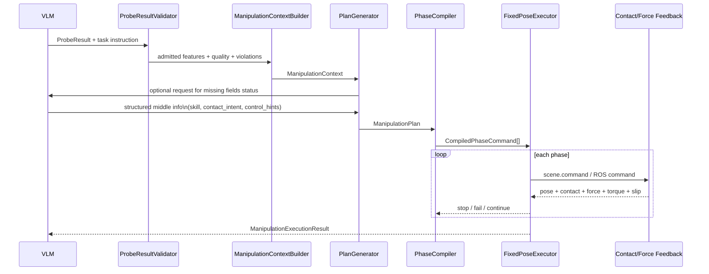

# VLM具身Benchmark中Probe到Manipulate管线设计深度研究报告

> **本地实现状态更新（2026-07-10）**：本报告提出的“夹爪先行、灵巧手后置”没有被
> 采用，VLM/ROS 横向内容也不属于当前 AllegroProbe 执行层。项目已经直接落地
> `mass / short_can / allegro / fixed-pose pick_place`，实际接口、关键问题处理、验收
> 阈值和 3 seed × 3 target 结果以
> `docs/v1/sgst_mani_3_short_can_pick_place.md` 为准。本报告其余内容保留为早期调研，
> 不能当作当前代码状态说明。

## 执行摘要

基于你给出的仓库背景与两份新增设计文档，当前最稳妥的路线不是让 VLM 直接输出低层 actuator 命令，也不是继续扩大 probe 动作库，而是把 `probe -> manipulate` 之间明确切成三个层级：**可验证的物理属性估计**、**可执行的中间协议**、**后端相关的控制编译与闭环执行**。这是两份新文档已经在概念上给出的方向：`ProbeResult -> ManipulationContext -> ManipulationPlan -> FixedPoseExecutor / PlanningControlExecutor`，并且文档已经明确指出 `grip_alpha` 不是力控命令、`target_normal_force_N` 必须经过 backend-specific 标定后才能变成真正的执行命令。

从具身 VLM 的研究现状看，这种“VLM 负责中层语义—物理决策，控制器负责高频闭环”的分层，非常符合主流做法。RT-2 和 OpenVLA 都把动作看作一种可结构化解码的表示，而不是直接让模型承担全部接触动力学；π₀ 则进一步说明，高频连续控制通常需要专门的 action module；最新的 TouchWorld 还专门把“视觉-语言高层规划”和“高频触觉残差修正”分开，以提高接触类任务的稳定性。与此同时，EmbodiedBench 与 Embodied3DBench 的结果都说明，当前 VLM 在低层 manipulation 与 interaction-oriented perception 上仍然薄弱，因此你的 benchmark 如果希望检验“probe 信息是否真的被利用”，中间协议必须显式、可审计、可映射，而不应把一切塞进黑盒动作输出。

对 v1 设计，我的核心建议是：**保留 probe 端当前的虚化/levitation 方案不动，但 manipulation 端不要延续“手穿过物体”的处理**。如果 manipulation 仍然依赖穿透或托举式“虚化”，那么 mass、stiffness、material 这些任务的操控有效性会被严重稀释，因为真正需要验证的抓持稳定性、法向力裕度、滑移风险、软物接触限力都被绕开了；fill 任务也会因为没有真实容器—手—液体耦合，而只能算“携带策略 benchmark”，不能算“倒液/流体操控 benchmark”。你上传的文档本身已经多次指出：当前 `fill_proxy/slosh_proxy` 只是代理量，不是真实液位或真实液体动力学；`mu_est` 与 `m_est_kg` 在不同 family 中也并不天然同时可得，因此 manipulation plan 必须显式记录 `missing_requirements` 并采用保守回退策略。fileciteturn0file0 fileciteturn0file1

因此，v1 最推荐的任务定义是：**mass 做 pick/carry，fill 先只做 upright carry，stiffness 以 guarded press 为主，material 以 slide_contact 或 conservative pick 为主；pour、灵巧手内操作、真实液体控制放到后续版本**。这个切分既继承了你文档中“固定位置模板 + phase 计划 + feedback gate”的设计，也与液体搬运、触觉识别和滑移抑制文献中的工程经验一致：液体运输本质上需要限制加速度、姿态变化和晃动；脆弱/柔软物体需要限力和限压入；低摩擦物体更适合滑移监测与闭环抓持，而不是简单增加闭合量。fileciteturn0file0 fileciteturn0file1 citeturn24academia1turn24academia3turn20academia1turn13academia3turn13academia0turn21academia0turn12academia3

最后，在实现优先级上，我建议先支持 **夹爪-only 后端**，再以同一中间协议去兼容 **灵巧手后端**。原因很直接：ROS 2 现成接口对夹爪和关节轨迹都已相当成熟，平行夹爪可以直接用 `position + max_effort` 再叠加 `max_velocity`；而多指灵巧手虽然表达能力更强，但 16 DoF 以上的关节空间、接触顺序、alpha-to-force 标定和多点接触稳定性会显著提高实现与调参复杂度。LEAP Hand 与 MOTIF Hand 的工作也说明，多指路线虽然越来越便宜，但即便是低成本开放灵巧手，成本、集成与数据采集复杂度仍明显高于夹爪路线

## 仓库、main.md与新增文档的关键点总结

下表区分“已直接确认”和“未直接取得但可从新增文档反推”的信息。需要特别说明：本次检索中，仓库网页与 `main.md` 本体没有被直接抓取到，因此关于 `main.md` 的总结只能基于两份新增文档中对上游接口路线的引用来反推；凡无法从文档中确认的地方，我都标注为“未直接取得”或“未指定”。fileciteturn0file0 fileciteturn0file1

| 对象 | 本次可得性 | 已确认关键点 | 对设计的直接含义 | 仍未明确之处 |
|---|---|---|---|---|
| 仓库 `RylWhite3zz/1stea` | **部分可得**：来自你的描述与两份新增 md；仓库页面未直接抓取成功 | 当前重点是 **probe 动作**；v1 family 面向 `stiffness / mass / fill / material`；对象族包括 `compressible_box / short_can / opaque_cup / surface_block`；当前阶段优先做 **FixedPoseExecutor** 路线，而不是通用抓取规划。fileciteturn0file0 | 说明 manipulation v1 应采用 **固定模板 + 阶段化 phase + 守护式闭环**，而不是上来做通用 IK、避碰、mesh 抓取或真实任务判定。fileciteturn0file0 | 仓库真实代码组织、`main.md` 具体字段、控制频率、仿真版本、日志结构、是否已有基类与 dataclass，**未直接取得**。 |
| `main.md` | **未直接取得** | 两份新增文档都表明它上游已定义一条接口链：`ProbeResult -> ManipulationContext -> ManipulationPlan -> FixedPoseExecutor / PlanningControlExecutor`。fileciteturn0file0 fileciteturn0file1 | 可以把本次工作理解为：不是重写 probe，而是在已有 `ProbeResult` 基础上补齐 manipulation 的“中间协议 + 计划编译 + 执行反馈”。fileciteturn0file1 | `main.md` 的原始字段、类定义、是否已有 JSON schema、是否已写 admission/gating 逻辑，**未直接取得**。 |
| `sgst_mani_1_fixed_pose.md` | **直接可得** | 明确主张：v1 先做 **plan generation**，并强调对象不能共用同一个抓取模板；推荐模板按 `(shape, skill, backend)` 区分；`ManipulationContext` 需要 `missing_requirements`；抓取力应分成“物理 force hint”与“backend-specific alpha/actuator policy”两层。fileciteturn0file0 | 这基本已经给出正确方向：VLM 不输出 actuator，而输出可编译的对象级、技能级和约束级信息。fileciteturn0file0 | 还缺：统一 JSON 协议、family 之间字段规范、真实 acceptance criteria、回退策略和实验标定表。 |
| `sgst_mani_2_dataflow.md` | **直接可得** | 明确了从 `ProbeResultValidator`、`ManipulationContextBuilder`、`SkillSelector`、`FixedPosePlanGenerator`、`PhaseCompiler` 到 `FixedPoseExecutor` 的全链路，并把最低层控制归结为 `scene.command(x, y, z, roll, tilt, yaw, grip)`；还强调了 `target_normal_force_N` 不是 actuator command，而 `grip_alpha` 需要标定。fileciteturn0file1 | 这恰好适合作为你的 **benchmark 可审计接口**：VLM 输出 -> 编译 -> 每步日志 -> 结果评价，链路清晰。fileciteturn0file1 | 仍缺：阶段终止条件的统一 schema、后端兼容层、真实/仿真都可复用的单位规范。 |
| 机器人与控制后端 | **部分可得** | 文档中出现 `reference` 与 `allegro` backend、`grip_alpha`、MuJoCo contact buffer、6-DoF wrist carriage、`object_pos/object_quat`、`wrist_force/wrist_torque` 等表述，说明当前至少有仿真后端和接触/力矩摘要。fileciteturn0file0 fileciteturn0file1 | manipulation 协议应显式区分 **backend name**、**可用反馈源** 与 **命令接口类型**。fileciteturn0file1 | 真实机器人平台、是否有 FT 传感器、是否有触觉皮肤、控制器 update rate、是否上 ROS 2，**未指定**。 |

综合看，这两份新增文档本身没有方向性错误，反而已经把最危险的坑提前写了出来：**不能把 `alpha` 当力、不能把 `fill_proxy` 当真实液位、不能让一个模板吃掉所有对象、不能把 manipulation 失败回写成 probe 失败**。这些判断与现有接触式操作、触觉识别和具身 VLM 研究结论是一致的。

## 待明确问题的深度调研结果与可选方案

先给总判断：**最不推荐**的是让 VLM 直接输出 `scene.command(...)` 的 7 个低层量；**最推荐**的是让 VLM 输出“对象级属性 + 接触模式 + 控制约束 + 成功判据”的中层协议，再由后端编译器把它映射到 ROS/仿真接口。这既符合 VLA/VLM 体系的主流结构，也和你当前文档中的 `ManipulationContext / ManipulationPlan / PhaseCompiler` 分层吻合。RT-2、OpenVLA、Code as Policies、VoxPoser 都在不同层面证明了：语言/视觉模型更擅长生成结构化动作描述、约束或程序，而不是直接负责接触动力学细节；TouchWorld 则进一步证明，接触任务往往需要独立的高频 tactile refinement。citeturn16academia0turn16academia3turn17academia0turn17academia1turn22academia3

| 待明确问题 | 方案 | 优点 | 缺点 | 实现难度 | 所需硬件/软件 | 数据格式示例 |
|---|---|---|---|---|---|---|
| VLM 应输出什么 | **方案 A：直接低层动作**，如 `x,y,z,roll,tilt,yaw,grip` | 最“端到端”，表面上简单 | 最难审计；一旦平台变化就不兼容；VLM 直接承担接触控制，稳定性最差；不利于证明 probe 信息被如何利用。citeturn16academia0turn1academia2 | 高 | 需要高频控制与大量 robotic data；当前文档并不支持。fileciteturn0file1 | `{"cmd":[...]}`
| VLM 应输出什么 | **方案 B：中层协议**，输出 family-specific 物理估计、接触模式、控制 hint、停止条件、风险门限 | 与 RT-2/OpenVLA/VoxPoser/Code as Policies 的“结构化动作表示/程序接口”更一致；可审计；最适合 benchmark。citeturn16academia0turn16academia3turn17academia0turn17academia1 | 需要额外实现编译器与 admission/gating | 中 | 只要已有 `ProbeResult` 与仿真反馈即可落地。fileciteturn0file0 fileciteturn0file1 | `{"skill":"carry","estimates":{"m_est_kg":0.42},"control_hints":{"target_normal_force_N":16.7}}` |
| VLM 应输出什么 | **方案 C：纯自然语言计划** | 便于 prompt | 不可执行、不可比较、不可量化；会把大量解析歧义推给后端 | 低 | 只需 VLM | `"轻拿轻放移动杯子"` |

我建议 **只采用方案 B**，并且把每个数值都包装为 `{value, unit, confidence, provenance}`，其中 `provenance` 只能取 `probe / default / derived / 未指定`。这样你才能在评测中区分“模型真的用到了 probe”还是“只是用了默认策略”。这个设计直接回应了你文档里 `missing_requirements` 的思想，也有利于过程型评估。fileciteturn0file0 fileciteturn0file1 citeturn1academia3

| family | 推荐 v1 技能定义 | VLM 必须输出的中间信息 | 推荐动作映射策略 | 是否必须闭环 | 数据格式示例 |
|---|---|---|---|---|---|
| `mass` | **pick / short carry** | `m_est_kg` 或 `weight_signal_N`、`confidence`、`shape`、`contact_mode`、`mu_est` 若无则标明“未指定” | 工程上把抓持需求视为“重量 × 安全系数 ÷ 有效摩擦”的保守近似；质量越大，`target_normal_force_N` 越高，`max_tcp_speed_mps` 与 `max_accel_mps2` 越低；若无 `mu_est`，只能用 conservative default 并记录 provenance。你文档的力提示两层映射是正确的。fileciteturn0file0 fileciteturn0file1 citeturn20academia3turn21academia0turn27academia0 | **必须**。因为质量变化直接影响 lift 后腕力、滑移与接触稳定性。citeturn20academia3turn12academia3 | `{"family":"mass","skill":"pick","estimates":{"m_est_kg":{"value":0.42,"unit":"kg","confidence":0.92,"provenance":"probe"}},"control_hints":{"target_normal_force_N":{"value":16.7,"unit":"N","provenance":"derived"}}}` |
| `fill` | **upright carry**；`pour` 建议暂缓到 v2 | `fill_proxy`、`slosh_proxy`、`weight_proxy_N`、容器姿态容忍度、`spill_proxy` 若存在；若没有真实液体或目标容器，则 `pour_target` 标“未指定” | 最优先映射不是“更大夹爪力”，而是**更慢、更稳、更直立**：`slosh_proxy` 越高，`max_tcp_speed_mps`、`max_accel_mps2`、`max_tilt_rad`、`max_yaw_rate_rps` 越小，`settle_time_s` 越长。真实倒液通常依赖重量变化或液面反馈闭环；只有 proxy liquid 时，建议 v1 先只做 transport，不宣称真实 pour。fileciteturn0file0 fileciteturn0file1 citeturn24academia1turn24academia3turn20academia1turn24academia2 | **必须**。至少要闭环监控腕力矩、容器倾角、支撑接触与漂移。citeturn20academia1turn24academia1 | `{"family":"fill","skill":"carry","estimates":{"fill_proxy":{"value":0.78,"unit":"1","provenance":"probe"},"slosh_proxy":{"value":0.31,"unit":"1","provenance":"probe"}},"control_hints":{"max_tilt_rad":{"value":0.18,"unit":"rad","provenance":"derived"},"settle_time_s":{"value":0.55,"unit":"s","provenance":"derived"}}}` |
| `stiffness` | **guarded press** 为主；soft pick 为次 | `k_est_N_per_m`、`compliance_m_per_N`、`safe_preload_N`、`max_indentation_m`、`preferred_contact_mode` | 刚度/顺从性最适合映射到 **预载力上限、闭合速度上限、压入深度上限**，而不是映射到大范围抓举策略。文献表明，触觉/振动信息能较早识别 stiffness；你文档里把 `press` 与 `pick` 拆开是对的。对于 v1，建议把 stiffness benchmark 主任务固定为 press，soft pick 仅作可选附加。fileciteturn0file0 citeturn13academia0turn13academia3 | **必须**。没有闭环就无法控制压入量与限力。citeturn13academia0turn18view0 | `{"family":"stiffness","skill":"press","estimates":{"k_est_N_per_m":{"value":480,"unit":"N/m","provenance":"probe"}},"control_hints":{"safe_preload_N":{"value":2.0,"unit":"N"},"max_indentation_m":{"value":0.006,"unit":"m"}}}` |
| `material` | **slide_contact** 为主；pick 需条件满足 | `mu_est`、`friction_ratio`、`material_class`、`texture_hint`、`slip_risk`；若无质量则 `pick_weight_requirement` 标“未指定” | `material` 的强项是给 **摩擦/滑移边界**，不是单独决定完整抓取。若只有 `mu_est` 而无质量，推荐先做 `slide_contact` 或 conservative regrasp；若要 pick，必须外接质量或采用保守默认质量。Texture/roughness 更适合作为 contact-mode 选择与 slip gate 的附加信息，而不是直接映射到抓持力。fileciteturn0file0 fileciteturn0file1 citeturn25academia0turn25academia1turn12academia3turn21academia0 | **必须**。因为 material 任务最核心就是接触质量与滑移监测。citeturn12academia3turn12academia2 | `{"family":"material","skill":"slide_contact","estimates":{"mu_est":{"value":0.24,"unit":"1","provenance":"probe"},"texture_hint":{"value":"smooth","provenance":"probe"}},"control_hints":{"slip_gate_threshold":{"value":0.08,"unit":"1"}}}` |

上表里最关键的一点是：**mass/fill 更偏向“搬运 envelope”问题，stiffness/material 更偏向“接触边界”问题**。这意味着你不应该给所有 family 统一一个 `pick` 技能定义。你现在的固定模板思想本来就已经承认这一点；建议在 benchmark 规范里把它写死，否则后续对比会非常混乱。fileciteturn0file0

| 设计维度 | 夹爪-only 路线 | 灵巧手路线 | levitation / 虚化路线 |
|---|---|---|---|
| 可行性 | **最高**。ROS 2 平行夹爪控制器原生支持位置控制，并可选速度与力接口；最适合先把 benchmark 跑通。citeturn9view2turn30view0 | **中等**。表达能力更强，但多点接触、关节耦合和后端标定复杂。Joint trajectory 与 effort 接口是存在的，但实现难度显著更高。citeturn10view0turn31view0turn31view1 | **最高**，但只在“实现容易”的意义上；对 manipulation benchmark 的物理可信度最差。fileciteturn0file0 |
| 适合的 v1 任务 | mass、fill carry、stiffness press、material slide，基本都能覆盖 | 以上全部 + 可扩展到多接触包络抓持和更复杂 regrasp | 仅适合作为 probe 中的“内部可观测性”技巧，不适合作为 manipulation 主机制 |
| 接口复杂度 | 低。`position + max_effort`，再叠加 `max_velocity` 即可。citeturn30view0turn9view2 | 高。需要 joint trajectory、可选 effort、接触顺序和手型模板。citeturn10view0turn31view0turn31view1 | 最低 |
| 闭环需求 | 中。抓持闭环 + slip gate 就够用 | 高。抓持闭环 + 多点接触 + 触觉/力矩残差最好都要 | 低，但会牺牲 benchmark 真实性 |
| 成本与实现复杂度 | 成本与集成复杂度最低；但当前具体夹爪平台与价格 **未指定** | 多指手已有更低成本开放方案：LEAP Hand 约 2000 美元，MOTIF 手在集成多模态传感后仍控制在 4000 美元以下；但研究级 Allegro 类平台通常更昂贵，且由 LEAP 论文可反推出 Allegro 级成本大约高一个量级。citeturn29academia0turn29academia1 | 软件成本最低，但 benchmark 有效性成本最高 |
| 推荐结论 | **v1 推荐默认后端** | **v2/v3 可扩展后端** | **仅保留在 probe，不建议进入 manipulation** |

如果把“让 VLM 利用 probe 信息”作为 benchmark 的中心命题，那么 **levitation 只应该是 probe 的实现技巧，不应该成为 manipulation 的主执行机制**。原因不是它“不能做”，而是它会把更难也更关键的物理问题——抓持稳定性、摩擦裕度、软物限力、液体晃动约束——全部短路掉；这样得到的 benchmark 其实更像 perception-to-cheat-policy，而不是 perception-to-manipulation。EmbodiedBench 和 IS-Bench 都在不同层面强调了过程导向、中间步骤和交互风险的重要性。citeturn1academia1turn1academia3

## 推荐的中间信息协议

下面给出我建议的 **probe -> manipulate 中间协议**。这个协议有四个设计目标：第一，**family 通用但字段可裁剪**；第二，**值、单位、置信度、来源分开**；第三，**缺失信息必须显式暴露**；第四，**既能编译到夹爪-only，也能编译到灵巧手**。这与新增文档强调的 `missing_requirements`、`fallback_policy`、`backend-specific policy` 完全一致，也和 ROS 2 里“上层给参考/轨迹、控制器负责执行”的接口思想一致。fileciteturn0file0 fileciteturn0file1 citeturn9view2turn10view0turn18view0

```json
{
  "$schema": "https://example.org/probe-manipulate.schema.json",
  "schema_version": "pm-v1",
  "scene_id": "string",
  "target_id": "string",
  "family": "mass | fill | stiffness | material",
  "skill": "pick | carry | press | slide_contact | pour",
  "backend": {
    "type": "parallel_gripper | dexterous_hand | unspecified",
    "name": "reference | allegro | unspecified"
  },
  "object": {
    "shape": "short_can | opaque_cup | compressible_box | surface_block | unspecified",
    "size_m": [0.0, 0.0, 0.0],
    "pose_world": {
      "position_m": [0.0, 0.0, 0.0],
      "quaternion_xyzw": [0.0, 0.0, 0.0, 1.0]
    },
    "grasp_forbidden_regions": ["rim", "top_opening"],
    "supporting_surface": "table | pedestal | unspecified"
  },
  "estimates": {
    "mass": { "value": null, "unit": "kg", "confidence": 0.0, "provenance": "probe | default | derived | 未指定" },
    "weight_proxy": { "value": null, "unit": "N", "confidence": 0.0, "provenance": "probe | default | derived | 未指定" },
    "fill_ratio_proxy": { "value": null, "unit": "1", "confidence": 0.0, "provenance": "probe | default | derived | 未指定" },
    "slosh_proxy": { "value": null, "unit": "1", "confidence": 0.0, "provenance": "probe | default | derived | 未指定" },
    "stiffness": { "value": null, "unit": "N/m", "confidence": 0.0, "provenance": "probe | default | derived | 未指定" },
    "compliance": { "value": null, "unit": "m/N", "confidence": 0.0, "provenance": "probe | default | derived | 未指定" },
    "friction_coeff": { "value": null, "unit": "1", "confidence": 0.0, "provenance": "probe | default | derived | 未指定" },
    "material_class": { "value": null, "provenance": "probe | default | derived | 未指定" },
    "texture_hint": { "value": null, "provenance": "probe | default | derived | 未指定" }
  },
  "contact_intent": {
    "mode": "pinch | enveloping | guarded_press | preload_slide | upright_side_grasp",
    "required_opposition": true,
    "upright_required": false
  },
  "control_hints": {
    "target_normal_force_N": null,
    "grip_width_m": null,
    "close_speed_mps": null,
    "max_tcp_speed_mps": null,
    "max_accel_mps2": null,
    "max_tilt_rad": null,
    "max_yaw_rate_rps": null,
    "safe_preload_N": null,
    "max_indentation_m": null,
    "settle_time_s": null,
    "slip_gate_threshold": null,
    "penetration_limit_m": null
  },
  "required_feedback": [
    "object_pose",
    "support_contact",
    "hand_normal_force",
    "wrist_force",
    "wrist_torque",
    "slip_signal"
  ],
  "missing_requirements": [],
  "fallback_policy": "reject | conservative_default | re-probe",
  "success_criteria": {
    "min_lift_height_m": null,
    "max_object_tilt_rad": null,
    "max_object_drift_m": null,
    "max_spill_proxy": null,
    "max_indentation_violation": null
  }
}
```

这个 schema 里，`control_hints` 的字段可以自然映射到 ROS 2 的常见控制接口。平行夹爪路线最直接：`grip_width_m` 对应夹爪位置，`target_normal_force_N` 或 `max_effort_N` 对应最大抓持力，而平行夹爪控制器文档也明确支持位置、速度和 effort 相关接口；多关节手则可以编译为 `JointTrajectory`，其点位中可包含 `positions / velocities / accelerations`，以及在某些接口组合下可附带 `effort`，这对于“保接触”类任务是有用的。若有腕部 FT 传感器，还可以把 admittance controller 作为 arm 级闭环层。citeturn30view0turn9view2turn10view0turn31view0turn31view1turn18view0

一个具体的 `mass / short_can / pick` 例子如下。这里我故意保留了 `friction_coeff` 的 `未指定` 情况，正是为了让 benchmark 能看出：当 `material probe` 未做时，系统用了保守默认，而不是偷偷假设已知。这个思想与新增文档里对 `missing_requirements` 的讨论是完全一致的。fileciteturn0file0

```json
{
  "schema_version": "pm-v1",
  "scene_id": "scene_014",
  "target_id": "obj_1",
  "family": "mass",
  "skill": "pick",
  "backend": { "type": "parallel_gripper", "name": "reference" },
  "object": {
    "shape": "short_can",
    "size_m": [0.066, 0.066, 0.115],
    "pose_world": {
      "position_m": [0.42, -0.08, 0.03],
      "quaternion_xyzw": [0.0, 0.0, 0.0, 1.0]
    },
    "grasp_forbidden_regions": [],
    "supporting_surface": "table"
  },
  "estimates": {
    "mass": { "value": 0.42, "unit": "kg", "confidence": 0.92, "provenance": "probe" },
    "friction_coeff": { "value": 0.70, "unit": "1", "confidence": 0.20, "provenance": "default" }
  },
  "contact_intent": {
    "mode": "pinch",
    "required_opposition": true,
    "upright_required": false
  },
  "control_hints": {
    "target_normal_force_N": 16.7,
    "grip_width_m": 0.058,
    "close_speed_mps": 0.02,
    "max_tcp_speed_mps": 0.06,
    "max_accel_mps2": 0.20,
    "penetration_limit_m": 0.005
  },
  "required_feedback": ["object_pose", "support_contact", "hand_normal_force", "slip_signal"],
  "missing_requirements": [],
  "fallback_policy": "conservative_default",
  "success_criteria": {
    "min_lift_height_m": 0.02,
    "max_object_drift_m": 0.01
  }
}
```

如果切到 `fill / opaque_cup / carry`，最重要的不是把 `fill_proxy` 翻译成一个新的夹爪闭合量，而是改写运动包络。液体搬运与 slosh-free 轨迹优化文献一致指出，速度、加速度和姿态变化约束比“多夹一点力”更关键；而“按倾倒出的重量闭环控制倒液量”的做法，则需要真实传感闭环与真实 liquid state，当前 proxy 流体版本并不具备这点。citeturn24academia1turn24academia3turn20academia1

```json
{
  "family": "fill",
  "skill": "carry",
  "backend": { "type": "parallel_gripper", "name": "reference" },
  "estimates": {
    "weight_proxy": { "value": 2.2, "unit": "N", "confidence": 0.81, "provenance": "probe" },
    "fill_ratio_proxy": { "value": 0.78, "unit": "1", "confidence": 0.80, "provenance": "probe" },
    "slosh_proxy": { "value": 0.31, "unit": "1", "confidence": 0.76, "provenance": "probe" }
  },
  "contact_intent": {
    "mode": "upright_side_grasp",
    "required_opposition": true,
    "upright_required": true
  },
  "control_hints": {
    "target_normal_force_N": 8.0,
    "max_tcp_speed_mps": 0.04,
    "max_accel_mps2": 0.12,
    "max_tilt_rad": 0.12,
    "max_yaw_rate_rps": 0.15,
    "settle_time_s": 0.55
  },
  "required_feedback": ["object_pose", "wrist_torque", "support_contact"],
  "missing_requirements": ["pour_target", "true_fluid_state"],
  "fallback_policy": "reject",
  "success_criteria": {
    "max_object_tilt_rad": 0.12,
    "max_spill_proxy": 0.05
  }
}
```

下面给出推荐的交互时序。这个时序图与两份设计文档中的分层基本一致，只是把 “VLM 输出中间信息，而不是直接出控制” 说得更明确。fileciteturn0file1



如果你要把它落到 ROS 2，上层推荐输出的是 **内部 JSON 协议**，而不是直接绑死某一个 ROS msg。编译后，夹爪-only 后端可以映射到 `GripperCommand` 与平行夹爪控制器参数，机械臂/灵巧手后端则映射到 `JointTrajectory`、必要时再叠加 admittance。这样能最大限度保持 benchmark 与执行平台解耦。citeturn30view0turn9view2turn10view0turn18view0

## 实验验证建议与评估指标

你这个 benchmark 的评测不应只看最终 success，而应该把 **probe 有效性、middle-info 可解释性、manipulation 执行质量** 分成三层。IS-Bench 的过程导向评估已经说明，仅看最终结果会掩盖中间风险；ros2_tracing 和 ROS 2 message-flow 分析则说明，对分布式机器人系统做 phase-level tracing 是现实可行的，开销也足够低。你自己的新增文档也已经提出要记录 `phase_reached`、`violations`、`trace` 和 `quality`。citeturn1academia3turn28academia0turn28academia1 fileciteturn0file1

| 评测层 | 建议指标 | 含义 | 数据采集建议 |
|---|---|---|---|
| Probe 层 | `property_error`、`rank_correlation`、`confidence_calibration` | 例如质量估计误差、fill 排序相关性、stiffness 与 material 的等级排序正确率 | 对每个对象记录 ground-truth 物理参数；对 proxy 任务单独记录“proxy ground-truth”，并明确与真实物理量分开。citeturn33academia1turn33academia0 |
| 中间协议层 | `field_completeness`、`provenance_correctness`、`missing_requirement_exposure_rate` | 检查 VLM 是否显式暴露缺失条件，而不是偷偷默认 | 对每次 episode 保存原始 `ProbeResult`、VLM 输出 JSON、经过编译后的 plan；对比哪些字段来自 probe、哪些来自默认值。fileciteturn0file0 |
| Execution 层 | `success_rate`、`phase_completion_ratio`、`timeout_rate`、`drop_rate` | 操作是否完成，以及失败发生在哪个 phase | 保存 phase-level trace，并统一失败码，如 `lost_contact / penetration_limit / support_contact / no_plan`。fileciteturn0file1 |
| Contact 安全层 | `max_penetration_m`、`peak_wrist_force_N`、`peak_wrist_torque_Nm`、`slip_event_count` | 是否靠不真实穿透或高冲击拿到“成功” | 仿真中直接输出 contact summary；真实平台可用 FT 与 tactile。fileciteturn0file1 citeturn13academia1turn12academia3 |
| Family-specific 层 | `mass_lift_margin`、`slosh_integral`、`indentation_violation`、`slide_path_completion` | 分别评价重量搬运、液体晃动、软物限力、低摩擦接触完成度 | mass 看 lift 后稳定与力裕度；fill 看 transport 期间姿态/晃动；stiffness 看压入量与限力；material 看滑移与路径完成。citeturn24academia1turn24academia3turn13academia0turn25academia1 |

对四个 family，我建议采用如下定量主指标：

| family | 主指标 | 次指标 | 解释 |
|---|---|---|---|
| `mass` | **搬运成功率**、**质量分组条件下的成功曲线** | `target_normal_force_N` 利用率、lift 后漂移、滑移次数 | 如果 probe 信息被真正使用，重物应触发更保守的 force/speed envelope，而不是和轻物同策略。fileciteturn0file0 |
| `fill` | **upright carry 成功率**、**slosh/tilt 违规率** | 运输时间、settle 时间、spill proxy | 在目前 proxy 液体设置下，最诚实的指标是“防晃与防倾倒”，而不是宣称真实倒液量控制。fileciteturn0file0 citeturn24academia1turn24academia3 |
| `stiffness` | **目标压接完成率**、**压入违规率** | 峰值力、接触建立时间、release 后恢复 | 文献表明 stiffness 估计更适合用于 grasp modulation / gentle interaction，而不是直接上线复杂抓举。citeturn13academia0turn13academia3 |
| `material` | **slide_contact 完成率**、**滑移检测召回率** | 低摩擦对象 pick 的保守拒绝率、误判率 | 如果没有质量信息，系统应允许合理拒绝 `pick`，而不是强行执行。fileciteturn0file0 citeturn12academia3turn21academia0 |

数据采集上，我建议你至少做三种“对照实验”。第一种是 **有 probe vs 无 probe**：同一个 manipulation executor，分别喂入真实 `ProbeResult`、默认常数、随机打乱的 property estimate，看 success 与安全指标差多少。第二种是 **显式中间协议 vs 直接语言描述**：比较结构化 JSON 和自然语言说明谁更稳定。第三种是 **夹爪-only vs 灵巧手**：在相同协议下比较执行增益与复杂度成本。这三种对照能直接证明 benchmark 的关键命题——“probe 信息是否真正转化成更好的 manipulation”。

如果你准备很快进入代码阶段，我建议最小可行验证先做这五个单元测试和三条标定曲线。单元测试是：重物比轻物生成更大的 `target_normal_force_N`；高 `slosh_proxy` 比低 `slosh_proxy` 生成更低 `max_tilt_rad`；软物体比硬物体生成更低 `safe_preload_N`；低摩擦比高摩擦生成更严格 `slip_gate_threshold`；`probe_valid == false` 时不生成 plan。标定曲线是：`grip_alpha -> hand_normal_force_N`、`grip_alpha -> penetration`、`slosh_proxy -> max_safe_speed`。这实际上就是你文档里“plan generation 先于 full executor”的延续。fileciteturn0file0 fileciteturn0file1

## 关键文献与优先参考链接

以下文献与官方文档，是我认为你后续实现时最值得优先参考的材料。它们分别覆盖了 **VLM/VLA 分层接口**、**ROS 执行接口**、**触觉与物理属性估计**、**液体搬运/倒液** 和 **过程型评测** 五个关键方向。

| 主题 | 优先参考 | 用途 |
|---|---|---|
| VLA 与结构化动作接口 | RT-2: Vision-Language-Action Models Transfer Web Knowledge to Robotic Control citeturn17academia1；π₀ citeturn26academia1 | 决定“VLM 输出什么层级的信息” |
| 触觉分层与高速反馈 | TouchWorld  | 说明为什么接触任务应把高层语义与高频触觉分开 |
| ROS 2 执行接口 | Parallel Gripper Controller 文档 Joint Trajectory Controller 文档 `GripperCommand.msg` `JointTrajectory.msg` 与 `JointTrajectoryPoint.msg` Admittance Controller 文档 | 统一你的执行协议与单位规范 |
| 物理属性与触觉估计 | Shape-independent Hardness Estimation Using GelSight At First Contact: Stiffness Estimation Using Vibrational Information Robust Learning of Tactile Force Estimation Design of a Biomimetic Tactile Sensor for Material Classification Spatio-temporal Attention Model for Tactile Texture Recognition In-Hand Object-Dynamics Inference using Tactile Fingertips | 定义 stiffness/material/texture 的表示与可观测量 |
| 液体搬运与倒液 | Geometric Slosh-Free Tracking for Robotic Manipulators A Solution to Slosh-free Robot Trajectory Optimization GOMP-FITPouring by Feel  | 定义 fill 对应的动作 envelope |
| 过程型评估与 tracing | IS-Bench ros2_tracingMessage Flow Analysis for ROS 2  | 把 benchmark 做成“可审计、可重放、可定位失败”的系统 |
| 当前方案本身 | `sgst_mani_1_fixed_pose.md``sgst_mani_2_dataflow.md` | 这是你当前设计抽象最直接的依据 |

最终建议可以浓缩成一句话：**v1 不要追求“VLM 直接操控灵巧手”，而要先把“probe 物理属性 -> 中层协议 -> 固定模板闭环执行”做成一个字段清楚、单位清楚、缺失条件清楚、评测清楚的 benchmark。** 这样你既能保留当前 probe 方案，又能把 mass、fill、stiffness、material 四类任务真正变成“probe 信息有没有被利用”的实验，而不是纯 prompt 工程或纯仿真假动作。fileciteturn0file0 fileciteturn0file1
